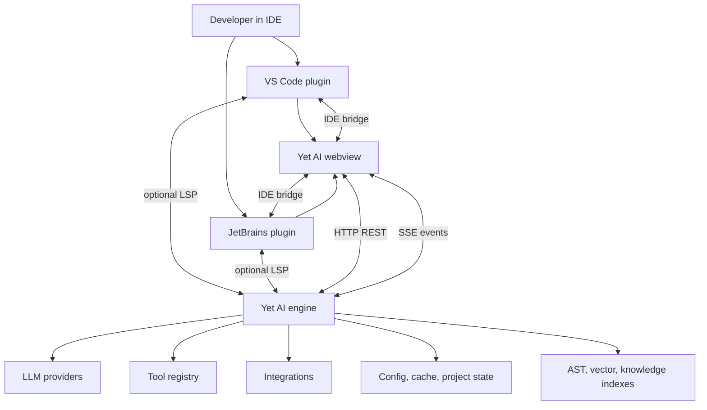
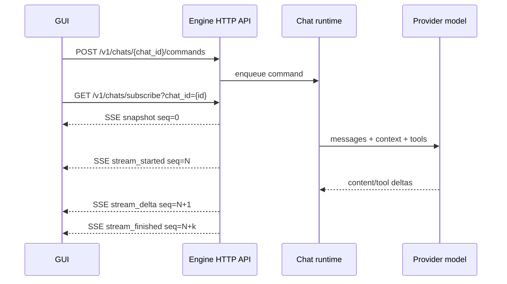

# 000 Reference Architecture Baseline

This document records the external architecture patterns that are useful for Yet AI without naming or copying any external implementation. Yet AI should use these notes as a conceptual baseline for its own independent code, identity, packaging, UI, and storage.

## Scope

The baseline covers a common AI coding assistant shape:

- a local engine process that exposes HTTP and optional LSP interfaces;
- a web GUI embedded in IDE webviews;
- VS Code and JetBrains host plugins;
- local project, cache, and user configuration storage;
- provider, tool, integration, indexing, and task-management boundaries.

The document intentionally avoids external product names, repository URLs, package IDs, binary names, and vendor identifiers. Private comparison notes belong in ignored local files only.

## Major subsystems

### Local engine

The engine is the stable runtime boundary. It should own chat sessions, model/provider configuration, tool execution, indexing, local storage, and integrations. It may expose:

- HTTP API under a versioned prefix such as `/v1/*`;
- SSE streams for chat state updates;
- optional LSP for editor-native completion, code lens, and document context;
- background workers for indexing, local state cleanup, task execution, provider refresh, and integration updates.

Yet AI must define its own binary name, storage layout, endpoint details, logs, diagnostics, and configuration schema.

### Web GUI

The GUI should be a thin webview app over engine and IDE contracts. It should own user experience, chat rendering, settings screens, provider setup, tool confirmations, and bridge clients. It should not own provider secrets, filesystem mutation, shell execution, or indexing.

Yet AI should build a new UI and design system rather than reproducing external screens, copy, icons, or visual hierarchy.

### VS Code plugin

The VS Code plugin should package or locate the engine and GUI assets, start or connect to the engine, host a webview, register commands and settings, and bridge IDE events to the GUI. Extension IDs, command prefixes, settings namespaces, view IDs, marketplace metadata, and support URLs must come from Yet AI identity decisions.

### JetBrains plugin

The JetBrains plugin should package or locate the engine and GUI assets, start or connect to the engine, host a JCEF tool window, register actions/settings/services, and bridge IDE events to the GUI. Plugin ID, package namespace, action IDs, notification groups, marketplace metadata, and update lineage must be independent Yet AI values.

## Component architecture

## Chat and SSE command flow

A useful chat contract separates commands from state delivery:

Key expectations:

- Every event has a monotonic `seq` value.
- A `snapshot` resets client state and sequence tracking.
- Sequence gaps trigger reconnect and a fresh snapshot.
- Tool confirmation and IDE tool execution pause the runtime until explicit decisions or results arrive.

## Local config, cache, and project state

Yet AI must isolate local data from every other product. Current target names from `product/identity.json` are:

- project state: `.yet-ai`;
- user config directory name: `yet-ai`;
- user cache directory name: `yet-ai`.

Project-local private state is ignored by default. Shareable project config should be introduced only after a documented format and explicit allowlist exist.

## Product-sensitive surfaces to avoid copying

External implementations often contain product-sensitive values in these surfaces:

- engine binary names and package artifacts;
- GUI package names and bundle identifiers;
- VS Code extension names, publisher IDs, settings prefixes, command IDs, view IDs, icons, and marketplace text;
- JetBrains plugin IDs, package namespaces, vendor fields, action IDs, notification groups, update lineage, and marketplace text;
- config/cache/project storage directories;
- product URLs, support links, issue trackers, update channels, and download buckets;
- UI labels, onboarding text, screenshots, icons, resource bundles, and visual design;
- release workflows, artifact paths, debug defaults, and test fixtures.

Do not copy these values. Define Yet AI equivalents in `product/identity.json` or in the relevant subsystem contract.

## Implementation guidance

- Use the subsystem split as a reference: local engine, web GUI, VS Code host plugin, JetBrains host plugin, and local state.
- Define identity before scaffolding packages.
- Keep runtime contracts explicit: commands, SSE events, optional LSP lifecycle, IDE bridge, tool confirmations, and provider capabilities.
- Prefer a clean scaffold that adopts architecture patterns intentionally.
- Track unknown product-sensitive values as blockers until audited.
