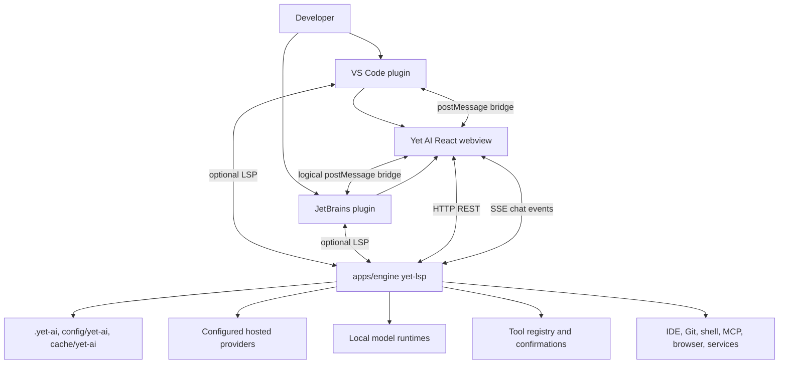

# 003 Target Architecture

Yet AI is a new product inspired by the external reference project's proven engine, GUI, and IDE plugin split. The goal is not to clone the external reference project's implementation or UI. The target is an independent local AI coding assistant with its own product identity, storage, packaging, visual language, interaction design, and release surfaces.

This document defines the target architecture and implementation roadmap. It should guide scaffolding and migration decisions, but it does not require copying all the external reference project code now. Physical folder layout can be introduced gradually as each subsystem becomes real.

## Implemented local baseline

The repository now contains buildable MVP scaffolds for the main local-first subsystems. This baseline is for local development, contract validation, and security hardening; it is not production-ready and does not claim full assistant feature completeness.

Implemented surfaces:

- `apps/engine`: Rust `yet-lsp` runtime with authenticated loopback HTTP/SSE endpoints, identity-aware storage names, local provider registry/config files, redacted provider responses, model summaries, chat command submission, and the first OpenAI-compatible direct streaming path through configured provider data.
- `apps/gui`: React/Vite browser shell with loopback-only runtime client, provider setup/status UI, chat command submission, fetch-streaming SSE parser, runtime error reporting, and browser/VS Code/JetBrains logical bridge detection.
- `apps/plugins/vscode`: VS Code extension shell with identity-checked manifest and bundled package-route identity, loopback runtime/dev URL validation, SecretStorage-backed manual runtime tokens, packaged GUI asset loading with placeholder fallback, MVP `connect`/`launch`/`auto` runtime modes, webview host, bootstrap/`host.ready` bridge, redacted runtime diagnostics, and guarded message handling.
- `apps/plugins/jetbrains`: JetBrains plugin shell with identity checks, Gradle build/tests, loopback runtime/dev URL validation, packaged GUI resource loading with placeholder fallback, MVP `connect`/`launch`/`auto` runtime modes, PasswordSafe-backed local session token, JCEF host boundary, and structural JSON bridge validation.
- `packages/contracts`: shared JSON Schemas and examples for current engine and bridge boundaries.

Known limitations:

- No marketplace packaging, signed/notarized engine bundle, production installer, or release flow is complete.
- IDE plugins support dev-preview packaged GUI assets and MVP local runtime connect/launch/auto modes, but they do not yet provide production-grade lifecycle management, bundled signed engine distribution, or installer integration.
- LSP completion/code-lens, full agent autonomy, indexing, tasks/knowledge, tool registry execution, shell/file mutation, file edits, and integration workflows are not implemented as production features.
- The provider/chat baseline is a local MVP only: configured local BYOK provider data plus OpenAI-compatible chat streaming.
- Privileged IDE actions remain disabled until strict schemas, request correlation, origin/source checks, engine policy checks, and user confirmation flows are in place.
- The provider baseline is intentionally narrow: local BYOK configuration plus OpenAI-compatible chat streaming. The engine and GUI now include sanitized provider-auth skeleton endpoints, a login-first status card, an API-key fallback, a local mock OAuth/PKCE contract harness, and a protected-file secret-store fallback. Real OpenAI/ChatGPT account login is not implemented in this baseline. The user approved a future experimental, high-risk Codex-like login task chain despite the lack of a public third-party OpenAI OAuth program; production OAuth, OS keychain storage, broader provider quirks, and advanced model capability handling remain follow-ups.

## Provider authentication strategy

The implemented real-provider flow is API-key/OpenAI-compatible direct provider access. Users configure a local provider endpoint and, when needed, paste an API key once into the engine-owned provider configuration flow. The GUI has a login-first provider-auth card, but real OpenAI/ChatGPT account login is not implemented. Current runtime responses either report login unavailable with API-key fallback copy, report API-key configured with a redacted hint, or expose mock-only pending/connected states used by local tests. The engine stores credentials locally through a central secret store abstraction, sends model requests directly to the configured provider, and returns only sanitized `auth.configured` and optional `auth.redacted` status to GUI clients. The current implementation uses a protected file fallback under the user config directory and keeps a read-only compatibility path for legacy provider config files that still contain `auth.apiKey`; new saves clear raw API keys from provider config JSON.

The provider-auth baseline is implemented as a sanitized local skeleton for `openai` and `openai-compatible`. It exposes `start`, `status`, `exchange`, and `disconnect` contracts, but default start/exchange do not contact external providers and do not perform account login. A local mock OAuth/PKCE-like harness can be enabled only by test requests and stores fake token material in isolated mock state so smoke tests can verify session, status, disconnect, and no-secret response behavior. This harness is not production OAuth and must not be described as real login support.

The user approved T-49 as an experimental Codex-like OpenAI/ChatGPT login implementation path despite the lack of a public third-party OpenAI OAuth program. This approval permits a local engine-owned implementation modeled after Codex-like behavior:

- PKCE/session state held by the engine;
- authorization URL handling and loopback callback or manual/device-style exchange where required by the chosen Codex-like flow;
- token exchange, refresh, revoke/disconnect, expiry handling, and migration behind the engine secret store;
- access token, refresh token, API-key, and auth metadata storage through OS keychain or protected local fallback;
- sanitized GUI status only, including non-secret account label, scopes, expiry, redacted hints, and safe error text.

This approval does not permit cookie scraping, browser profile import, browser cookie reuse, direct import or reading of `~/.codex/auth.json` or other tools' credential files, or any required Yet AI hosted backend, account, managed gateway, product credit balance, or cloud workspace for core local provider setup or chat. It also does not claim production readiness, official OpenAI partnership, or general public OAuth support. If private endpoints, provider-specific client identity, account headers, model-access surfaces, refresh endpoints, or revoke endpoints are used, the risk must remain explicit in user-facing and architecture documentation.

Future OpenAI/ChatGPT account authentication should use a login-first UX where it is officially supported and compliant:

- The preferred flow is browser or device OAuth with PKCE, a loopback callback or polling status, and a provider-issued access/refresh token pair held only by the engine.
- If the provider supports exchanging an account login token for an API credential intended for API calls, the engine may do that exchange locally and store the resulting credential as engine-owned secret material.
- If account login is unavailable, unsupported, or too risky for API use, the GUI should guide the user to sign in to the OpenAI platform, create an API key or project key, paste it once into Yet AI, and then clear the input after save.
- API-key configuration remains the implemented baseline, the fallback path, and the compatibility route for OpenAI-compatible gateways and local runtimes.

Reference inspection found a useful pattern in the external implementation: provider OAuth is engine-owned; GUI starts a login flow, opens an authorization URL, handles callback/manual/device progress, polls sanitized provider status, and can disconnect; refresh and provider calls remain in the engine. The same inspection also found risk areas that Yet AI should not adopt blindly: ChatGPT backend endpoints and account-specific headers may be private or product-surface-specific, importing credentials from another CLI or browser profile can blur ownership and consent, and a login flow can become coupled to a provider-specific client ID or non-public backend contract. Yet AI should not plan cookie/session scraping, browser cookie import, or reuse of another tool's local credentials as the default. Those would require a separate explicit approval, provenance review, and security design.

Future GUI-facing auth status should stay sanitized. Candidate state fields are non-secret values such as `type`, `configured`, `status`, `authSource`, `expiresAt`, `accountLabel`, `scopes`, `supportsRefresh`, `lastError`, and `redacted`. Raw access tokens, refresh tokens, API keys, cookies, session IDs, browser profile paths, and provider authorization codes must never be returned by provider status, capability, or model endpoints and must never appear in logs.

Secret storage is an engine boundary. The initial `FileSecretStore` fallback centralizes put/get/delete by provider id and secret kind for API keys, OAuth access tokens, OAuth refresh tokens, and auth metadata. It is intentionally narrower than the external reference implementation's provider config patching and OAuth refresh machinery: Yet AI keeps the abstraction separate before real provider login, avoids credential import from other tools, and treats OS keychain support as the next backend behind the same trait. A future migration should move any legacy `providers.d/{id}.json` raw API keys into the active secret backend, then rewrite provider configs without raw secret fields.

## Architecture principles

- Keep a local engine process as the stable runtime boundary for chat, tools, providers, indexing, storage, and IDE-facing services.
- Treat Yet AI as local-first BYOK: the IDE plugin starts or connects to a local runtime on the user's machine, and core chat, completion, agent, settings, and project workflows must not require a hosted Yet AI backend, Yet AI account, managed model gateway, product credit balance, or cloud workspace.
- Send model and embedding requests directly from the local runtime to configured hosted providers or local runtimes. Yet AI does not proxy normal provider traffic through a required product cloud.
- Keep IDE plugins thin: they should start or connect to the engine, host the webview, bridge IDE events, and expose native editor integrations.
- Build a new UI and design system for Yet AI instead of recreating the external reference project's screens, navigation, typography, copy, or visual hierarchy.
- Use `product/identity.json` as the product identity source for names, IDs, directories, binary names, package names, and marketplace metadata.
- Introduce folders and packages only when they are needed. Documentation and contracts can exist before code.
- Preserve explicit contracts between subsystems so each can be built and tested independently.

## Target repository structure

The preferred long-term layout is:

```text
apps/
  engine/              # Rust local agent service: HTTP, SSE, LSP, tools, providers, storage
  gui/                 # React webview UI and design system, bundled for IDE hosts
  plugins/
    vscode/            # VS Code extension host, engine launcher, webview bridge, LSP client
    jetbrains/         # JetBrains plugin host, engine launcher, JCEF bridge, LSP client
product/
  identity.json        # Product identity source of truth
  identity.schema.json # Identity validation schema
docs/
  architecture/        # Architecture decisions, baselines, contracts, roadmaps
scripts/               # Build, validation, packaging, code generation, release helpers
```

Alternative names such as `packages/gui`, `crates/engine`, or top-level `plugins/` are acceptable if they better fit tooling, but the boundaries should remain the same. The folder structure should be introduced incrementally:

1. Keep documentation and identity files first.
2. Add empty or minimal subsystem scaffolds only when a phase needs buildable code.
3. Avoid a bulk import or global rename of the external reference project as the default implementation path.
4. Add shared scripts after at least two subsystems need the same workflow.

## Subsystem boundaries

### `apps/engine`

The engine is the local Yet AI runtime. It is not a required cloud backend and should eventually own:

- HTTP API under a versioned prefix such as `/v1`.
- chat command handling and SSE streaming state.
- LSP server capabilities for editor completion, code lens, diagnostics-like notifications, and active document context if selected.
- provider configuration, model capability discovery, OAuth/token storage where needed, and provider adapters.
- direct calls to configured hosted providers and local runtimes, with no required Yet AI managed model gateway.
- tool registry and tool execution policy, including confirmation boundaries.
- project, cache, and user config resolution based on `product/identity.json`.
- local indexes, trajectories, tasks, knowledge, logs, and integration state.

The current MVP implementation includes `/v1/ping`, `/v1/caps`, provider registry endpoints, model summaries, one chat command endpoint, one SSE stream, and a narrow OpenAI-compatible streaming path. It remains a foundation, not a full agent runtime.

Provider settings and credentials are local runtime state. The engine stores secrets through a central provider secret store abstraction. The current backend is protected user config file storage; OS credential storage/keychain support should replace or wrap it next. Raw secrets must not be returned to GUI-facing responses after save.

### `apps/gui`

The GUI is the webview app packaged into IDE hosts and optionally served standalone in development. It should own:

- Yet AI chat experience, settings, onboarding, provider setup, tool confirmations, and future task/knowledge surfaces.
- a new UI and design system distinct from the external reference project, including layout, component language, empty states, icons, colors, and motion.
- typed HTTP client contracts for engine REST endpoints.
- an SSE chat subscription client with reconnect and snapshot recovery semantics.
- an IDE bridge adapter for VS Code, JetBrains, and browser development mode.

The GUI should not own provider secrets, filesystem mutation, shell execution, or long-running indexes. Those remain engine responsibilities.

Provider setup screens should render provider availability, status, model summaries, validation errors, and secret placeholders returned by the engine. They must not persist raw provider secrets in GUI storage and must not call model providers directly.

### `apps/plugins/vscode`

The VS Code plugin should own:

- extension manifest metadata generated or checked against `product/identity.json`.
- engine binary discovery, launch, debug connection mode, lifecycle, logs, and health checks.
- webview panel/sidebar hosting with packaged GUI assets.
- VS Code `postMessage` bridge implementation.
- LSP client startup if the engine exposes LSP for completion/code-lens.
- command, setting, keybinding, and activity bar namespaces based on Yet AI identity values.

It should avoid duplicating chat state or provider configuration beyond native IDE settings needed to locate and launch the engine.

It must not implement provider adapters or require a Yet AI cloud workspace for normal operation.

Current VS Code runtime-token behavior is split by launch mode. Manual `connect` tokens are stored through VS Code SecretStorage under the Yet AI local runtime token key, with the deprecated `yetai.sessionToken` setting kept only as a dev-preview fallback. In `auto` and `launch`, the extension generates an ephemeral per-session token, passes it to the engine through `YET_AI_AUTH_TOKEN`, and delivers it to the GUI only through the trusted `host.ready` bridge rather than inline HTML or settings. Provider API keys are never stored by the VS Code extension; they are submitted to and stored by the local engine provider flow.

Current VS Code URL policy requires `runtimeUrl` and `guiDevUrl` to be loopback `http` or `https` URLs with no userinfo, query string, or fragment. `guiDevUrl` supports HTTP and HTTPS loopback dev servers. A plugin-launched runtime uses HTTP because the local engine launcher binds the loopback HTTP API; HTTPS runtime URLs are valid only in `connect` mode for an externally managed loopback runtime.

Current VS Code diagnostics and reports are safe-share surfaces. Runtime diagnostics redact local session tokens, bearer and authorization headers, cookies, secret query parameters, JSON secret fields, OAuth/code-verifier values, known dev tokens, JWT-like values, long opaque token-like values, and private binary paths by reporting configured/discovered engine binary basenames. Manual preview reports should omit secrets, private paths, query strings, URL fragments, bridge payloads, and provider responses.

Local VSIX dev-preview packaging copies `product/identity.json` into the compiled extension output as bundled identity metadata. The extension loads bundled identity first and falls back to the repository identity only for development worktrees. This is a local package-route integrity check, not a marketplace or production release claim.

### `apps/plugins/jetbrains`

The JetBrains plugin should own:

- Gradle and `plugin.xml` metadata generated or checked against `product/identity.json`.
- engine binary discovery, launch, debug connection mode, lifecycle, logs, and health checks.
- JCEF tool window hosting with packaged GUI assets.
- JetBrains-to-webview bridge equivalent to the VS Code bridge.
- LSP client integration if selected for completion/code-lens.
- action IDs, settings IDs, notification groups, package namespace, and plugin ID based on Yet AI identity values.

It should keep platform-specific services separate from engine-owned AI behavior.

It must not implement provider adapters or require a Yet AI cloud workspace for normal operation.

### `product/`

The product directory owns stable identity and product-sensitive configuration. Implementation packages should consume or validate against this contract instead of scattering values such as `Yet AI`, `yet-lsp`, `.yet-ai`, `yetai`, and `ai.yet.plugin` independently.

### `docs/architecture`

Architecture docs own decisions, baselines, contracts, risks, and staged implementation plans. They should be updated before irreversible package layout, protocol, identity, or storage decisions.

### `scripts/`

Scripts should eventually own repeatable workflows:

- identity validation and manifest checks.
- local build orchestration.
- packaging GUI assets into IDE plugins.
- engine binary copy/signing/notarization helpers.
- release metadata validation.

Scripts should start small and should not become hidden application logic.

## Boundary contracts

### Engine HTTP API surface

The engine should expose a versioned local HTTP API. Initial target endpoints:

- `GET /v1/ping` returns health, version, product ID, and engine readiness.
- `GET /v1/caps` returns supported engine capabilities, local runtime mode, no-cloud-required signal, direct provider access signal, enabled features, provider/model summaries, and IDE integration flags.
- `GET /v1/config` and `POST /v1/config` expose safe user-editable settings after the storage model exists.
- `GET /v1/providers` returns provider summaries, status, configured/authenticated flags, model counts, capability summaries, and secret placeholders without exposing raw secrets to the GUI.
- `POST /v1/providers` creates a provider configuration with local-only credentials or endpoint settings.
- `PATCH /v1/providers/{id}` updates provider metadata, enabled state, model selections, and replacement credentials without returning raw secrets.
- `DELETE /v1/providers/{id}` removes a provider configuration and associated local credential material where possible.
- `POST /v1/providers/{id}/test` checks provider reachability and authentication from the local runtime and returns sanitized status/errors.
- `POST /v1/provider-auth/{provider}/start` is currently a sanitized skeleton. Default real-provider calls report login unavailable; mock-only test calls can return a local session and authorization URL without real tokens.
- `GET /v1/provider-auth/{provider}/status?session_id=...` returns sanitized provider-auth state such as login unavailable, API-key configured, mock pending, mock connected, or revoked.
- `POST /v1/provider-auth/{provider}/exchange` is currently a sanitized skeleton. Default real-provider calls do not exchange external codes; mock-only test calls validate local fake sessions and store fake mock token state.
- `POST /v1/provider-auth/{provider}/disconnect` clears mock/future OAuth state where present and does not delete API-key provider configs.
- Future `GET /v1/provider-auth/{provider}/callback` may receive loopback browser callbacks for providers that support local redirects.
- `GET /v1/models` returns normalized model summaries from configured providers and local capability metadata.
- `GET /v1/tools` exposes tool metadata, confirmation requirements, and availability.
- `POST /v1/chats/{chat_id}/commands` accepts chat commands.
- `GET /v1/chats/subscribe?chat_id={chat_id}` streams chat state over SSE.

Later increments can add integration, indexing, task, knowledge, checkpoint, and trajectory endpoints. Endpoint names should be designed for Yet AI, not copied blindly.

Future Yet AI backend or cloud services are optional extensions only. If added, they must be modeled as optional providers, integrations, update/control-plane features, or account-assisted services. They must not become a required dependency for core local chat, completion, agent, provider configuration, project storage, or IDE-hosted GUI workflows.

### Local API security model

The local engine API is a privileged surface because future endpoints may read project context, manage provider configuration, edit files, run tools, call integrations, or launch local processes. Security requirements must be part of the first engine scaffold, not a later hardening pass.

Minimum rules:

- Bind to loopback only by default (`127.0.0.1` / `::1`) or use a local socket/named pipe where practical.
- Require a per-session bearer token or equivalent local capability secret for every HTTP and SSE request. The plugin/engine launch flow owns token creation and delivery to the GUI.
- Deny arbitrary CORS origins. Development browser mode must use an explicit allowlist and must not enable privileged IDE actions by default.
- Reject mutating requests that are unauthenticated, missing the session token, or coming from an untrusted origin.
- Never return raw provider secrets, OAuth refresh tokens, shell environment secrets, or private integration credentials through GUI-facing endpoints.
- Enforce tool authorization and confirmation policy in the engine even if the GUI or IDE bridge is compromised.
- Log security-relevant denials without logging secret values.

### Chat command and SSE event stream

The chat protocol should keep command submission separate from state delivery.

Commands are sent to:

```text
POST /v1/chats/{chat_id}/commands
```

Initial command types:

- `user_message`
- `abort`
- `regenerate`
- `update_message`
- `remove_message`
- `tool_decision`
- `ide_tool_result`
- `set_params`

State is received from:

```text
GET /v1/chats/subscribe?chat_id={chat_id}
```

Initial SSE event types:

- `snapshot`
- `stream_started`
- `stream_delta`
- `stream_finished`
- `message_added`
- `message_updated`
- `message_removed`
- `thread_updated`
- `runtime_updated`
- `queue_updated`
- `pause_required`
- `ide_tool_required`
- `error`

Contract rules:

- Every event carries a monotonic `seq` value within a chat stream.
- `snapshot` resets client state and sequence tracking.
- Sequence gaps trigger reconnect and fresh snapshot.
- Streaming deltas should be typed and append-only where possible.
- Tool confirmation and IDE tool execution pause the runtime until a command resolves the pause.

### LSP usage

Yet AI should use LSP only where native editor integration benefits from an editor protocol:

- code completion.
- code lens or code vision.
- active document and workspace notifications.
- lightweight diagnostics/status notifications if needed.

Chat, provider configuration, tool confirmations, and large structured UI state should stay on HTTP and SSE. If an early milestone does not include completion or code-lens, LSP can be deferred while the engine still uses HTTP for chat.

### IDE to GUI postMessage bridge

The GUI should communicate with IDE hosts through a small typed bridge. The bridge must support browser development mode with no IDE present.

Initial IDE to GUI messages:

- `host.ready`
- `host.themeChanged`
- `host.activeFileChanged`
- `host.selectionChanged`
- `host.workspaceChanged`
- `host.toolResult`
- `host.openedFromCommand`

Initial GUI to IDE messages:

- `gui.ready`
- `gui.openFile`
- `gui.revealRange`
- `gui.applyWorkspaceEditRequest`
- `gui.copyText`
- `gui.showNotification`
- `gui.executeIdeTool`
- `gui.getHostContext`

VS Code should implement this with webview `postMessage`. JetBrains should implement the same logical contract through JCEF/browser messaging. The GUI should depend on the logical bridge, not on host-specific APIs.

Bridge security rules:

- Every bridge payload must be schema-validated at the receiver boundary before dispatch.
- Messages must include a protocol version, `type`, and request/correlation ID for request-response flows.
- Host/source/origin must be verified where the platform supports it; browser development mode must use a non-privileged mock bridge.
- `host.toolResult` and other responses must correlate to outstanding engine/IDE tool requests and must not be accepted as free-form unsolicited authority.
- GUI requests for workspace edits, IDE tool execution, shell-like actions, or file mutation require host and/or engine policy checks plus user confirmation where appropriate.
- Keep safe UI messages (theme, active file, notifications) conceptually separate from privileged messages (edits, tool results, filesystem actions).

### Config and storage resolution

Yet AI must isolate storage from the external reference project and from other products.

Target directories from `product/identity.json`:

- project state: `.yet-ai`.
- user config directory name: `yet-ai` under platform-specific config roots.
- user cache directory name: `yet-ai` under platform-specific cache roots.

Resolution rules:

- Engine owns all final path resolution and exposes safe summaries to GUI/plugins.
- Plugins may pass workspace root, extension version, debug flags, and optional overrides to the engine.
- Provider secrets should live behind the engine secret store abstraction in OS credential storage or protected user config, not in GUI state and not in committed project files.
- Project-specific trajectories, tasks, knowledge, and integration config should live under `.yet-ai` and be private by default.
- `.yet-ai/` must be ignored by default unless a specific shareable subfile is intentionally designed and explicitly allowlisted later.
- Secrets must never be written to `.yet-ai`; shareable project config and private local state must be split before any committed project config format is introduced.
- Cacheable indexes, logs, downloads, trajectories, tool outputs, and temporary assets should be treated as private local data unless explicitly documented otherwise.
- Migration from temporary paths to final paths requires an explicit migration document.

### Provider and integration boundaries

Providers and integrations are engine-owned capabilities exposed through HTTP metadata and actions.

Provider boundary:

- GUI renders setup and status but does not call model providers directly.
- GUI may start provider login and display sanitized login progress, but it must not receive or persist raw OAuth tokens, API keys, cookies, browser sessions, or refresh tokens.
- GUI does not persist raw provider secrets. It may submit a secret once for save/test flows, then only render sanitized configured/authenticated state and replacement controls.
- Engine stores credentials locally, resolves model capabilities, applies defaults, normalizes provider APIs, and calls configured hosted providers or local runtimes directly.
- Plugins do not know provider-specific details except for native authentication flows if explicitly required, and they do not duplicate provider adapters.
- A future Yet AI backend can appear only as an optional provider, integration, or control-plane extension; it is not part of the core provider path.

Integration boundary:

- Engine owns integrations such as Git hosting, local shell, databases, Docker, browser automation, MCP, and project indexing.
- GUI presents integration configuration and logs through typed endpoints.
- Plugins expose IDE-only tools such as active file context, range reveal, editor edits, and native notifications through the bridge.
- Risky tools require explicit confirmation policies enforced by the engine and reflected in GUI.

## Target architecture diagram



## Phased roadmap

The approved near-term implementation sequence is local-first and incremental. Foundation phases 1-6 now have buildable MVP baselines, but they remain development scaffolds and require hardening before production packaging or privileged workflows.

### 1. Local runtime skeleton — MVP baseline complete

- Implemented a minimal Rust local runtime with `/v1/ping`, `/v1/caps`, loopback binding, bearer-token authentication, identity-aware storage names, and SSE chat plumbing.
- Remaining work: production launch lifecycle, stronger CORS/origin policy, optional LSP, shutdown/lifecycle hardening, and packaging.

### 2. Provider registry, configuration, and secret redaction — MVP baseline complete

- Implemented local provider configuration storage, central secret store abstraction with protected file fallback, sanitized provider status responses, redacted secret hints, provider CRUD/test endpoints, and model summaries.
- Remaining work: OS keychain backend, legacy secret migration, broader validation, provider-specific capability discovery, OAuth flows, and migration policy.

### 3. OpenAI-compatible direct provider adapter and streaming — MVP baseline complete

- Implemented the first direct BYOK OpenAI-compatible chat path and normalized streamed provider chunks into local chat/SSE events.
- Remaining work: broader streaming parser coverage, provider quirks, cancellation/shutdown handling, retries, model capability enforcement, and expanded tests.

### 4. GUI local provider setup and runtime client — MVP baseline complete

- Implemented a React/Vite shell with loopback runtime URL validation, token-in-memory handling, provider setup/status, secret-field clearing, chat submission, fetch-streaming SSE, and bridge diagnostics.
- Remaining work: production UI/design system, packaged build consumption by IDE hosts, richer chat state, reconnect UX, accessibility pass, and no-secret regression coverage as surfaces expand.

### 5. VS Code local runtime host — MVP baseline complete

- Implemented identity-checked extension metadata, bundled identity loading for local package routes, strict loopback runtime/dev URL validation, packaged GUI asset loading, webview shell, safe bootstrap serialization, exact-origin dev iframe forwarding, MVP local runtime `connect`/`launch`/`auto` modes, SecretStorage for manual connect-mode runtime tokens, ephemeral launch-mode tokens delivered through `host.ready`, `/v1/ping` health check, redacted runtime diagnostics/logs, cleanup on deactivate, and narrow `gui.ready`/`host.ready` bridge handling.
- Remaining work: marketplace packaging, signed/notarized engine bundles, production installer, deeper extension-host lifecycle tests, LSP wiring, and privileged IDE action policies.

### 6. JetBrains local runtime host — MVP baseline complete

- Implemented identity-checked Gradle/plugin metadata, loopback runtime/dev URL validation, packaged GUI resource loading, PasswordSafe local session token storage, JCEF shell, structured bridge parsing, MVP local runtime `connect`/`launch`/`auto` modes, `/v1/ping` health check, launched process cleanup, and bridge/runtime URL tests.
- Remaining work: marketplace packaging, signed/notarized engine bundles, production installer, plugin verifier flow, optional LSP wiring, deeper lifecycle tests, and privileged IDE action policies.

### 7. Login-based GPT first message — mandatory future milestone planned

- Planned separately in `docs/architecture/006-login-based-gpt-first-message.md` after the VS Code no-manual-runtime first-message milestone.
- Target UX: open the IDE, have the plugin start or connect to the local runtime, connect a provider/account safely through engine-owned auth, and send the first GPT message without manual runtime-token copying or manual engine launch.
- The safe/default real-provider path remains the API-key or project-key fallback until official provider OAuth/device/auth feasibility, contracts, local mock smoke, manual real-provider checklist, and privacy/security review pass.
- Official login paths must use provider-supported OAuth/device/auth mechanisms where available. Cookie scraping, browser profile import, other-tool credential import, and private web-session reuse are not production defaults.
- The current experimental Codex-like path remains high-risk/private-endpoint-style, mock-only for automation, and manual real-account testing only when explicitly accepted.

### Follow-up contract hardening before privileged flows

- Bridge payload schemas must be made strict for each privileged GUI/plugin message before file edits, IDE tool execution, workspace mutation, shell-like behavior, or host-authorized tool result flows are implemented.
- Non-`user_message` chat command payload schemas such as tool decisions, IDE tool results, parameter changes, message updates, removals, aborts, and regeneration must be made strict before those commands can trigger privileged engine behavior.
- Receiver-side schema validation, request correlation, origin/source checks where available, and engine policy checks must be implemented before privileged GUI, plugin, or tool flows are enabled.

## Independent build and test strategy

Each subsystem should be independently buildable and testable.

### Engine

- `cargo check` for compile and borrow/type validation.
- `cargo test` for unit tests and protocol/storage tests.
- Contract tests for HTTP responses, command validation, and SSE sequence behavior.
- Storage tests using temporary config/cache/project directories.

### GUI

- TypeScript type checks for API and bridge contracts.
- lint and formatting checks.
- unit tests for reducers/hooks/API clients.
- component tests for the new UI and design system.
- mocked SSE tests for snapshot, reconnect, sequence gap, and stream delta behavior.

### VS Code plugin

- TypeScript compile and lint.
- extension host tests for activation, command registration, webview creation, bridge messages, and debug engine connection.
- manifest validation against `product/identity.json`.

### JetBrains plugin

- Gradle build and Kotlin/Java tests.
- plugin verifier when a real shell exists.
- tests for service startup, tool window registration, bridge messages, and debug engine connection.
- metadata validation against `product/identity.json`.

### Cross-subsystem contracts

- `packages/contracts` owns the shared JSON Schemas and golden examples for engine HTTP payloads, chat SSE events, and IDE bridge messages.
- JSON schema or generated TypeScript/Rust/Kotlin types for shared protocol messages where practical.
- golden contract fixtures for chat commands, SSE events, bridge messages, and capability responses.
- smoke tests that start engine, load GUI in development mode, and exercise `/v1/ping`, `/v1/caps`, one command, and one SSE event.

## Risks and decision points

### Risks

- Copying too much external reference code too early can preserve unwanted branding, storage paths, UX assumptions, and hidden product coupling.
- Designing contracts too narrowly can block JetBrains or VS Code requirements later.
- Deferring storage isolation can leak or mix data with the external reference project installations.
- Recreating the external reference project UI directly would conflict with the goal of a new UI and product experience.
- Adding providers, tools, and integrations before confirmation policy is clear can create safety and trust issues.
- Maintaining separate VS Code and JetBrains bridges can drift without shared typed bridge fixtures.

### Decision points

- Final repository layout before significant code scaffolding.
- Whether the engine starts with HTTP-only chat or includes LSP in the first scaffold.
- Whether shared protocol types are generated from schemas or manually maintained.
- Which provider is first for real chat streaming.
- Which IDE plugin is implemented first beyond a shell.
- Which parts of `product/identity.json` remain temporary before marketplace packaging.
- Whether any external reference code is selectively imported later, and under what audit and rewrite rules.

## Architecture foundation status

The architecture foundation is sufficient for the current MVP baseline because:

- the repo structure and subsystem boundaries are documented.
- HTTP, SSE, LSP, postMessage, storage, provider, and integration contracts are described.
- the roadmap avoids requiring a full external reference copy now.
- the plan explicitly prioritizes Yet AI's new UI and design system.
- each implemented subsystem has an independent build and test strategy.

Future architecture updates should track production packaging, engine launch lifecycle, privileged tool policy, LSP rollout, and broader provider/indexing/integration phases before those features are implemented.
