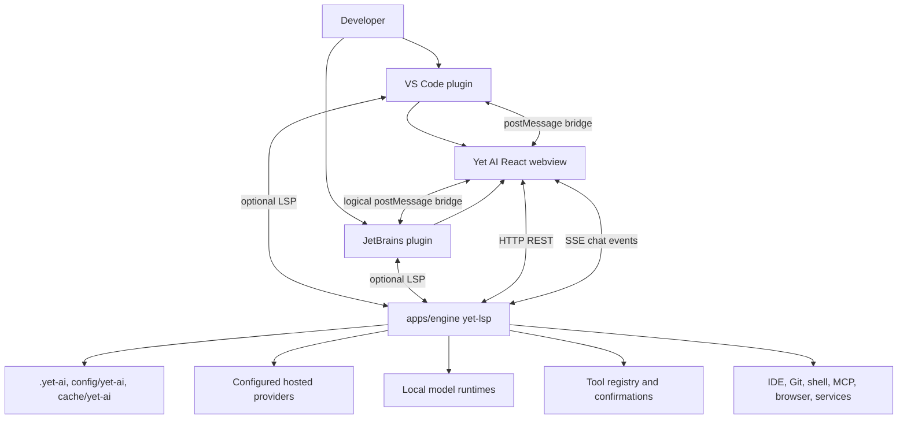

# 003 Target Architecture

Yet AI is a new product inspired by the external reference project's proven engine, GUI, and IDE plugin split. The goal is not to clone the external reference project's implementation or UI. The target is an independent local AI coding assistant with its own product identity, storage, packaging, visual language, interaction design, and release surfaces.

This document defines the target architecture and implementation roadmap. It should guide scaffolding and migration decisions, but it does not require copying all the external reference project code now. Physical folder layout can be introduced gradually as each subsystem becomes real.

## Architecture principles

- Keep a local engine process as the stable runtime boundary for chat, tools, providers, indexing, storage, and IDE-facing services.
- Treat Yet AI as local-first BYOK: the IDE plugin starts or connects to a local runtime on the user's machine, and core chat, completion, agent, settings, and project workflows must not require a hosted Yet AI backend, Yet AI account, managed model gateway, product credit balance, or cloud workspace.
- Send model and embedding requests directly from the local runtime to configured hosted providers or local runtimes. Yet AI does not proxy normal provider traffic through a required product cloud.
- Keep IDE plugins thin: they should start or connect to the engine, host the webview, bridge IDE events, and expose native editor integrations.
- Build a new UI and design system for Yet AI instead of recreating the external reference project's screens, navigation, typography, copy, or visual hierarchy.
- Use `product/identity.json` as the product identity source for names, IDs, directories, binary names, package names, and marketplace metadata.
- Introduce folders and packages only when they are needed. Documentation and contracts can exist before code.
- Preserve explicit contracts between subsystems so each can be built and tested independently.

## Target repository structure

The preferred long-term layout is:

```text
apps/
  engine/              # Rust local agent service: HTTP, SSE, LSP, tools, providers, storage
  gui/                 # React webview UI and design system, bundled for IDE hosts
  plugins/
    vscode/            # VS Code extension host, engine launcher, webview bridge, LSP client
    jetbrains/         # JetBrains plugin host, engine launcher, JCEF bridge, LSP client
product/
  identity.json        # Product identity source of truth
  identity.schema.json # Identity validation schema
docs/
  architecture/        # Architecture decisions, baselines, contracts, roadmaps
scripts/               # Build, validation, packaging, code generation, release helpers
```

Alternative names such as `packages/gui`, `crates/engine`, or top-level `plugins/` are acceptable if they better fit tooling, but the boundaries should remain the same. The folder structure should be introduced incrementally:

1. Keep documentation and identity files first.
2. Add empty or minimal subsystem scaffolds only when a phase needs buildable code.
3. Avoid a bulk import or global rename of the external reference project as the default implementation path.
4. Add shared scripts after at least two subsystems need the same workflow.

## Subsystem boundaries

### `apps/engine`

The engine is the local Yet AI runtime. It is not a required cloud backend and should eventually own:

- HTTP API under a versioned prefix such as `/v1`.
- chat command handling and SSE streaming state.
- LSP server capabilities for editor completion, code lens, diagnostics-like notifications, and active document context if selected.
- provider configuration, model capability discovery, OAuth/token storage where needed, and provider adapters.
- direct calls to configured hosted providers and local runtimes, with no required Yet AI managed model gateway.
- tool registry and tool execution policy, including confirmation boundaries.
- project, cache, and user config resolution based on `product/identity.json`.
- local indexes, trajectories, tasks, knowledge, logs, and integration state.

Initial implementation can be much smaller: `/v1/ping`, `/v1/caps`, one chat command endpoint, one SSE stream, and static provider placeholders are enough for a minimal baseline.

Provider settings and credentials are local runtime state. The engine may store secrets in OS credential storage or protected user config, but raw secrets must not be returned to GUI-facing responses after save.

### `apps/gui`

The GUI is the webview app packaged into IDE hosts and optionally served standalone in development. It should own:

- Yet AI chat experience, settings, onboarding, provider setup, tool confirmations, and future task/knowledge surfaces.
- a new UI and design system distinct from the external reference project, including layout, component language, empty states, icons, colors, and motion.
- typed HTTP client contracts for engine REST endpoints.
- an SSE chat subscription client with reconnect and snapshot recovery semantics.
- an IDE bridge adapter for VS Code, JetBrains, and browser development mode.

The GUI should not own provider secrets, filesystem mutation, shell execution, or long-running indexes. Those remain engine responsibilities.

Provider setup screens should render provider availability, status, model summaries, validation errors, and secret placeholders returned by the engine. They must not persist raw provider secrets in GUI storage and must not call model providers directly.

### `apps/plugins/vscode`

The VS Code plugin should own:

- extension manifest metadata generated or checked against `product/identity.json`.
- engine binary discovery, launch, debug connection mode, lifecycle, logs, and health checks.
- webview panel/sidebar hosting with packaged GUI assets.
- VS Code `postMessage` bridge implementation.
- LSP client startup if the engine exposes LSP for completion/code-lens.
- command, setting, keybinding, and activity bar namespaces based on Yet AI identity values.

It should avoid duplicating chat state or provider configuration beyond native IDE settings needed to locate and launch the engine.

It must not implement provider adapters or require a Yet AI cloud workspace for normal operation.

### `apps/plugins/jetbrains`

The JetBrains plugin should own:

- Gradle and `plugin.xml` metadata generated or checked against `product/identity.json`.
- engine binary discovery, launch, debug connection mode, lifecycle, logs, and health checks.
- JCEF tool window hosting with packaged GUI assets.
- JetBrains-to-webview bridge equivalent to the VS Code bridge.
- LSP client integration if selected for completion/code-lens.
- action IDs, settings IDs, notification groups, package namespace, and plugin ID based on Yet AI identity values.

It should keep platform-specific services separate from engine-owned AI behavior.

It must not implement provider adapters or require a Yet AI cloud workspace for normal operation.

### `product/`

The product directory owns stable identity and product-sensitive configuration. Implementation packages should consume or validate against this contract instead of scattering values such as `Yet AI`, `yet-lsp`, `.yet-ai`, `yetai`, and `ai.yet.plugin` independently.

### `docs/architecture`

Architecture docs own decisions, baselines, contracts, risks, and staged implementation plans. They should be updated before irreversible package layout, protocol, identity, or storage decisions.

### `scripts/`

Scripts should eventually own repeatable workflows:

- identity validation and manifest checks.
- local build orchestration.
- packaging GUI assets into IDE plugins.
- engine binary copy/signing/notarization helpers.
- release metadata validation.

Scripts should start small and should not become hidden application logic.

## Boundary contracts

### Engine HTTP API surface

The engine should expose a versioned local HTTP API. Initial target endpoints:

- `GET /v1/ping` returns health, version, product ID, and engine readiness.
- `GET /v1/caps` returns supported engine capabilities, local runtime mode, no-cloud-required signal, direct provider access signal, enabled features, provider/model summaries, and IDE integration flags.
- `GET /v1/config` and `POST /v1/config` expose safe user-editable settings after the storage model exists.
- `GET /v1/providers` returns provider summaries, status, configured/authenticated flags, model counts, capability summaries, and secret placeholders without exposing raw secrets to the GUI.
- `POST /v1/providers` creates a provider configuration with local-only credentials or endpoint settings.
- `PATCH /v1/providers/{id}` updates provider metadata, enabled state, model selections, and replacement credentials without returning raw secrets.
- `DELETE /v1/providers/{id}` removes a provider configuration and associated local credential material where possible.
- `POST /v1/providers/{id}/test` checks provider reachability and authentication from the local runtime and returns sanitized status/errors.
- `GET /v1/models` returns normalized model summaries from configured providers and local capability metadata.
- `GET /v1/tools` exposes tool metadata, confirmation requirements, and availability.
- `POST /v1/chats/{chat_id}/commands` accepts chat commands.
- `GET /v1/chats/subscribe?chat_id={chat_id}` streams chat state over SSE.

Later increments can add integration, indexing, task, knowledge, checkpoint, and trajectory endpoints. Endpoint names should be designed for Yet AI, not copied blindly.

Future Yet AI backend or cloud services are optional extensions only. If added, they must be modeled as optional providers, integrations, update/control-plane features, or account-assisted services. They must not become a required dependency for core local chat, completion, agent, provider configuration, project storage, or IDE-hosted GUI workflows.

### Local API security model

The local engine API is a privileged surface because future endpoints may read project context, manage provider configuration, edit files, run tools, call integrations, or launch local processes. Security requirements must be part of the first engine scaffold, not a later hardening pass.

Minimum rules:

- Bind to loopback only by default (`127.0.0.1` / `::1`) or use a local socket/named pipe where practical.
- Require a per-session bearer token or equivalent local capability secret for every HTTP and SSE request. The plugin/engine launch flow owns token creation and delivery to the GUI.
- Deny arbitrary CORS origins. Development browser mode must use an explicit allowlist and must not enable privileged IDE actions by default.
- Reject mutating requests that are unauthenticated, missing the session token, or coming from an untrusted origin.
- Never return raw provider secrets, OAuth refresh tokens, shell environment secrets, or private integration credentials through GUI-facing endpoints.
- Enforce tool authorization and confirmation policy in the engine even if the GUI or IDE bridge is compromised.
- Log security-relevant denials without logging secret values.

### Chat command and SSE event stream

The chat protocol should keep command submission separate from state delivery.

Commands are sent to:

```text
POST /v1/chats/{chat_id}/commands
```

Initial command types:

- `user_message`
- `abort`
- `regenerate`
- `update_message`
- `remove_message`
- `tool_decision`
- `ide_tool_result`
- `set_params`

State is received from:

```text
GET /v1/chats/subscribe?chat_id={chat_id}
```

Initial SSE event types:

- `snapshot`
- `stream_started`
- `stream_delta`
- `stream_finished`
- `message_added`
- `message_updated`
- `message_removed`
- `thread_updated`
- `runtime_updated`
- `queue_updated`
- `pause_required`
- `ide_tool_required`
- `error`

Contract rules:

- Every event carries a monotonic `seq` value within a chat stream.
- `snapshot` resets client state and sequence tracking.
- Sequence gaps trigger reconnect and fresh snapshot.
- Streaming deltas should be typed and append-only where possible.
- Tool confirmation and IDE tool execution pause the runtime until a command resolves the pause.

### LSP usage

Yet AI should use LSP only where native editor integration benefits from an editor protocol:

- code completion.
- code lens or code vision.
- active document and workspace notifications.
- lightweight diagnostics/status notifications if needed.

Chat, provider configuration, tool confirmations, and large structured UI state should stay on HTTP and SSE. If an early milestone does not include completion or code-lens, LSP can be deferred while the engine still uses HTTP for chat.

### IDE to GUI postMessage bridge

The GUI should communicate with IDE hosts through a small typed bridge. The bridge must support browser development mode with no IDE present.

Initial IDE to GUI messages:

- `host.ready`
- `host.themeChanged`
- `host.activeFileChanged`
- `host.selectionChanged`
- `host.workspaceChanged`
- `host.toolResult`
- `host.openedFromCommand`

Initial GUI to IDE messages:

- `gui.ready`
- `gui.openFile`
- `gui.revealRange`
- `gui.applyWorkspaceEditRequest`
- `gui.copyText`
- `gui.showNotification`
- `gui.executeIdeTool`
- `gui.getHostContext`

VS Code should implement this with webview `postMessage`. JetBrains should implement the same logical contract through JCEF/browser messaging. The GUI should depend on the logical bridge, not on host-specific APIs.

Bridge security rules:

- Every bridge payload must be schema-validated at the receiver boundary before dispatch.
- Messages must include a protocol version, `type`, and request/correlation ID for request-response flows.
- Host/source/origin must be verified where the platform supports it; browser development mode must use a non-privileged mock bridge.
- `host.toolResult` and other responses must correlate to outstanding engine/IDE tool requests and must not be accepted as free-form unsolicited authority.
- GUI requests for workspace edits, IDE tool execution, shell-like actions, or file mutation require host and/or engine policy checks plus user confirmation where appropriate.
- Keep safe UI messages (theme, active file, notifications) conceptually separate from privileged messages (edits, tool results, filesystem actions).

### Config and storage resolution

Yet AI must isolate storage from the external reference project and from other products.

Target directories from `product/identity.json`:

- project state: `.yet-ai`.
- user config directory name: `yet-ai` under platform-specific config roots.
- user cache directory name: `yet-ai` under platform-specific cache roots.

Resolution rules:

- Engine owns all final path resolution and exposes safe summaries to GUI/plugins.
- Plugins may pass workspace root, extension version, debug flags, and optional overrides to the engine.
- Provider secrets should live in OS credential storage or protected user config, not in GUI state and not in committed project files.
- Project-specific trajectories, tasks, knowledge, and integration config should live under `.yet-ai` and be private by default.
- `.yet-ai/` must be ignored by default unless a specific shareable subfile is intentionally designed and explicitly allowlisted later.
- Secrets must never be written to `.yet-ai`; shareable project config and private local state must be split before any committed project config format is introduced.
- Cacheable indexes, logs, downloads, trajectories, tool outputs, and temporary assets should be treated as private local data unless explicitly documented otherwise.
- Migration from temporary paths to final paths requires an explicit migration document.

### Provider and integration boundaries

Providers and integrations are engine-owned capabilities exposed through HTTP metadata and actions.

Provider boundary:

- GUI renders setup and status but does not call model providers directly.
- GUI does not persist raw provider secrets. It may submit a secret once for save/test flows, then only render sanitized configured/authenticated state and replacement controls.
- Engine stores credentials locally, resolves model capabilities, applies defaults, normalizes provider APIs, and calls configured hosted providers or local runtimes directly.
- Plugins do not know provider-specific details except for native authentication flows if explicitly required, and they do not duplicate provider adapters.
- A future Yet AI backend can appear only as an optional provider, integration, or control-plane extension; it is not part of the core provider path.

Integration boundary:

- Engine owns integrations such as Git hosting, local shell, databases, Docker, browser automation, MCP, and project indexing.
- GUI presents integration configuration and logs through typed endpoints.
- Plugins expose IDE-only tools such as active file context, range reveal, editor edits, and native notifications through the bridge.
- Risky tools require explicit confirmation policies enforced by the engine and reflected in GUI.

## Target architecture diagram



## Phased roadmap

The approved near-term implementation sequence is local-first and incremental. Runtime, provider, GUI, and plugin work should proceed in this order so credentials, direct provider calls, and host responsibilities are defined before privileged flows are added.

### 1. Local runtime skeleton

- Create the minimal local engine process only when buildable code is needed.
- Implement health and capability contracts such as `/v1/ping` and `/v1/caps`.
- Establish local storage roots, loopback binding, session authentication shape, and no-cloud-required capability signals.
- Keep provider execution as placeholders until provider storage and redaction boundaries exist.

### 2. Provider registry, configuration, and secret redaction

- Define local provider configuration storage owned by the engine.
- Add sanitized provider status responses, secret placeholders, and save/test request contracts.
- Ensure raw provider credentials stay local and are not returned to GUI-facing clients after save.
- Keep GUI and plugins out of provider adapter implementation and credential persistence.

### 3. OpenAI-compatible direct provider adapter and streaming

- Implement the first direct BYOK provider path for OpenAI-compatible hosted providers and local gateways.
- Stream model output through the local runtime chat/SSE contract.
- Preserve the no-required-cloud contract for core chat and provider execution.
- Add focused contract and runtime tests for streaming and sanitized provider errors.

### 4. GUI local provider setup and runtime client

- Build the GUI runtime client against the local engine contracts.
- Add provider setup/status flows that submit secrets only for save/test and discard raw values after requests.
- Render sanitized provider availability, validation errors, and model summaries from engine responses.
- Keep the UI visually independent and avoid storing provider secrets in GUI state or browser storage.

### 5. VS Code local runtime host

- Add the VS Code host that launches or connects to the local runtime.
- Host the packaged GUI webview and pass the local session token through the approved bridge flow.
- Implement bridge messages needed for safe context and basic host actions before privileged IDE/tool flows.
- Avoid duplicating provider adapters, chat runtime, or credential persistence in the extension.

### 6. JetBrains local runtime host

- Add the JetBrains host that launches or connects to the local runtime.
- Host the packaged GUI through JCEF and implement the same logical bridge contract.
- Reuse the local runtime and provider contracts rather than adding JetBrains-specific provider behavior.
- Add optional LSP only when completion/code-lens work starts.

### Follow-up contract hardening before privileged flows

- Bridge payload schemas must be made strict for each privileged GUI/plugin message before file edits, IDE tool execution, workspace mutation, shell-like behavior, or host-authorized tool result flows are implemented.
- Non-`user_message` chat command payload schemas such as tool decisions, IDE tool results, parameter changes, message updates, removals, aborts, and regeneration must be made strict before those commands can trigger privileged engine behavior.
- Receiver-side schema validation, request correlation, origin/source checks where available, and engine policy checks must be implemented before privileged GUI, plugin, or tool flows are enabled.

## Independent build and test strategy

Each subsystem should be independently buildable and testable.

### Engine

- `cargo check` for compile and borrow/type validation.
- `cargo test` for unit tests and protocol/storage tests.
- Contract tests for HTTP responses, command validation, and SSE sequence behavior.
- Storage tests using temporary config/cache/project directories.

### GUI

- TypeScript type checks for API and bridge contracts.
- lint and formatting checks.
- unit tests for reducers/hooks/API clients.
- component tests for the new UI and design system.
- mocked SSE tests for snapshot, reconnect, sequence gap, and stream delta behavior.

### VS Code plugin

- TypeScript compile and lint.
- extension host tests for activation, command registration, webview creation, bridge messages, and debug engine connection.
- manifest validation against `product/identity.json`.

### JetBrains plugin

- Gradle build and Kotlin/Java tests.
- plugin verifier when a real shell exists.
- tests for service startup, tool window registration, bridge messages, and debug engine connection.
- metadata validation against `product/identity.json`.

### Cross-subsystem contracts

- `packages/contracts` owns the shared JSON Schemas and golden examples for engine HTTP payloads, chat SSE events, and IDE bridge messages.
- JSON schema or generated TypeScript/Rust/Kotlin types for shared protocol messages where practical.
- golden contract fixtures for chat commands, SSE events, bridge messages, and capability responses.
- smoke tests that start engine, load GUI in development mode, and exercise `/v1/ping`, `/v1/caps`, one command, and one SSE event.

## Risks and decision points

### Risks

- Copying too much external reference code too early can preserve unwanted branding, storage paths, UX assumptions, and hidden product coupling.
- Designing contracts too narrowly can block JetBrains or VS Code requirements later.
- Deferring storage isolation can leak or mix data with the external reference project installations.
- Recreating the external reference project UI directly would conflict with the goal of a new UI and product experience.
- Adding providers, tools, and integrations before confirmation policy is clear can create safety and trust issues.
- Maintaining separate VS Code and JetBrains bridges can drift without shared typed bridge fixtures.

### Decision points

- Final repository layout before significant code scaffolding.
- Whether the engine starts with HTTP-only chat or includes LSP in the first scaffold.
- Whether shared protocol types are generated from schemas or manually maintained.
- Which provider is first for real chat streaming.
- Which IDE plugin is implemented first beyond a shell.
- Which parts of `product/identity.json` remain temporary before marketplace packaging.
- Whether any external reference code is selectively imported later, and under what audit and rewrite rules.

## Near-term acceptance for architecture foundation

This target architecture is sufficient when:

- the repo structure and subsystem boundaries are documented.
- HTTP, SSE, LSP, postMessage, storage, provider, and integration contracts are described.
- the roadmap avoids requiring a full external reference copy now.
- the plan explicitly prioritizes Yet AI's new UI and design system.
- each future subsystem has an independent build and test strategy.
