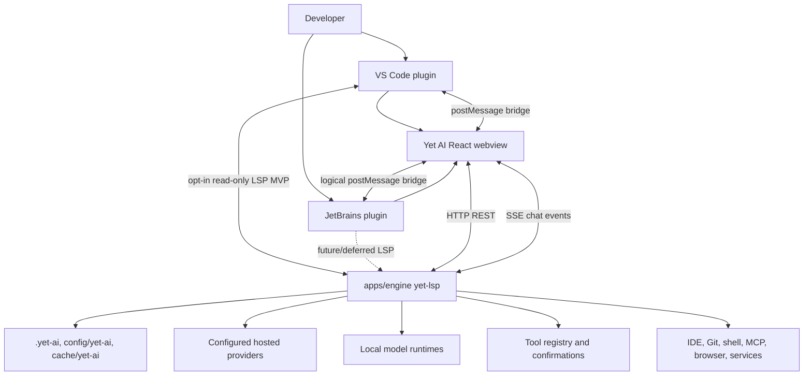

# 003 Target Architecture

Yet AI is a new product inspired by the external reference project's proven engine, GUI, and IDE plugin split. The goal is not to clone the external reference project's implementation or UI. The target is an independent local AI coding assistant with its own product identity, storage, packaging, visual language, interaction design, and release surfaces.

This document defines the target architecture and implementation roadmap. It should guide scaffolding and migration decisions, but it does not require copying all the external reference project code now. Physical folder layout can be introduced gradually as each subsystem becomes real.

## Implemented local baseline

The repository now contains buildable MVP scaffolds for the main local-first subsystems. This baseline is for local development, contract validation, and security hardening; it is not production-ready and does not claim full assistant feature completeness.

Implemented surfaces:

- `apps/engine`: Rust `yet-lsp` runtime with authenticated loopback HTTP/SSE endpoints, identity-aware storage names, local provider registry/config files, engine-owned local chat history, redacted provider responses, normalized provider/model readiness metadata, chat command submission, the first OpenAI-compatible direct streaming path through configured provider data, and a separate read-only `--lsp-stdio` mode over portable Tokio stdin/stdout for bounded editor-supplied document lifecycle plus deterministic local completion/hover status proofs and bounded document-symbol support.
- `apps/gui`: React/Vite browser shell with loopback-only runtime client, provider setup/status UI, sanitized model readiness display, local conversation list/create/switch/delete UI backed by engine history endpoints, chat command submission, fetch-streaming SSE parser, runtime error reporting, and browser/VS Code/JetBrains logical bridge detection.

- `apps/plugins/vscode`: VS Code extension shell with identity-checked manifest and bundled package-route identity, loopback runtime/dev URL validation, SecretStorage-backed manual runtime tokens, packaged GUI asset loading with placeholder fallback, MVP `connect`/`launch`/`auto` runtime modes, webview host, bootstrap/`host.ready` bridge, bounded active editor/selection context snapshot delivery, redacted runtime diagnostics, guarded message handling, an off-by-default read-only LSP client that starts a separate no-secret `yet-lsp --lsp-stdio` process for local `file` document sync plus deterministic completion/hover status proofs and bounded document-symbol support, and a local ignored root dev-preview VSIX artifact plus checksum published by `npm run prepare:vscode-preview` under `dist/plugins/vscode/`.
- `apps/plugins/jetbrains`: JetBrains plugin shell with identity checks, Gradle build/tests, loopback runtime/dev URL validation, packaged GUI resource loading with placeholder fallback, MVP `connect`/`launch`/`auto` runtime modes, PasswordSafe-backed local session token, JCEF host boundary, structural JSON bridge validation, and bounded active editor/selection context snapshot delivery through the same `host.contextSnapshot` contract as VS Code.
- `packages/contracts`: shared JSON Schemas and examples for current engine and bridge boundaries, plus future/simulator-facing no-idle planner scheduler and sanitized agent progress contracts.
- `scripts/check-planner-scheduler.mjs`, `scripts/planner-scheduler-state.mjs`, `scripts/planner-scheduler-tick.mjs`, `scripts/smoke-planner-no-idle.mjs`, and `scripts/smoke-planner-resume.mjs`: local-only pure scheduler reducer, durable simulator state, one-tick CLI runner, no-idle smoke, and restart/resume smoke for the no-idle contract. They do not implement production autonomous orchestration.
- `scripts/planner-agent-progress.mjs`, `scripts/planner-agent-progress-state.mjs`, `scripts/planner-agent-progress-report.mjs`, `scripts/planner-agent-progress-run.mjs`, `scripts/check-agent-progress.mjs`, `scripts/smoke-agent-progress.mjs`, `scripts/smoke-agent-progress-endpoint.mjs`, and `scripts/smoke-gui-agent-progress.mjs`: local-only sanitized progress reducer/classifier, durable event-state helper, compact CLI reporter, explicit local command wrapper, reducer/state checks, deterministic simulator smoke, focused endpoint smoke, and deterministic GUI/runtime smoke for the agent progress observability contract. The engine exposes read-only `GET /v1/agent-progress`, can load populated sanitized snapshots from an engine-owned local progress source, returns an empty list when that source is missing, and the GUI renders a read-only Agent progress panel. The writer/helper path is for explicit local developer workflows only. They do not implement production background agents, runner hooks, task-board integration, git merges, shell authority, tool execution, provider calls, cloud sync, hosted services, or workspace mutation from the GUI or endpoint.

Known limitations:

- VS Code can publish a local ignored dev-preview VSIX artifact at `dist/plugins/vscode/yet-ai-vscode-<version>-dev-preview.vsix` with a `.sha256` checksum for install-from-file smoke testing, and JetBrains has a comparable local ignored ZIP dev-preview artifact. No marketplace publication, signing, notarization, production installer, or production release flow is complete.
- IDE plugins support dev-preview packaged GUI assets and MVP local runtime connect/launch/auto modes, but they do not yet provide production-grade lifecycle management, bundled signed engine distribution, or installer integration.
- The functional read-only LSP MVP is available only as engine stdio plus opt-in VS Code local document/completion/hover/document-symbol wiring and spawned stdio smoke coverage. Completion and hover are deterministic local status proofs, and document symbols are bounded names/ranges derived only from editor-supplied cached text. Production AI completions, code-lens/code-vision, provider-backed completions, model calls on keystrokes, diagnostics from providers, JetBrains LSP support, full agent autonomy, autonomous file reads/indexing, tasks/knowledge, tool registry execution, shell/tool execution, shell/file mutation, file edits/apply patch, background agent autonomy, production agent progress observability wiring, and integration workflows are not implemented as production features.
- The provider/chat baseline is a local MVP only: configured local BYOK provider data plus OpenAI-compatible chat streaming gated by sanitized local provider/model readiness metadata and engine-owned local chat history. The local HTTP boundary rejects malformed, type-invalid, or oversized JSON with sanitized errors, applies an explicit `/v1` body limit for current provider/auth/chat command payloads, and validates chat ids before chat history, command, or SSE subscribe work.
- Privileged IDE actions remain disabled until strict schemas, request correlation, origin/source checks, engine policy checks, and user confirmation flows are in place.
- The provider baseline is intentionally narrow: local BYOK configuration plus OpenAI-compatible chat streaming. The engine and GUI now include sanitized provider-auth endpoints, a login-first status card, an API-key fallback, a local mock OAuth/PKCE contract harness, an explicit-risk experimental Codex-like path for `openai`, a composite OS-keychain-plus-protected-file secret-store policy, and atomic migration for legacy inline provider API keys. Official/public/production OpenAI or ChatGPT OAuth login is not implemented. The experimental Codex-like path is private-endpoint-style and high-risk, mock-only in automated tests, and manual real-account use only when explicitly accepted. Production OAuth, broader provider quirks, and advanced model capability handling remain follow-ups.

## Provider authentication strategy

The implemented safe/default real-provider flow is API-key/OpenAI-compatible direct provider access. Users configure a local provider endpoint and, when needed, paste an API key once into the engine-owned provider configuration flow. The GUI has a login-first provider-auth card, but official/public/production OpenAI or ChatGPT OAuth login is not implemented. Default non-experimental start/exchange calls report login unavailable with API-key fallback copy, default status can report API-key configured with a redacted hint, and mock pending/connected states exist only in the local test harness. A separate explicit-risk experimental Codex-like path exists for `openai`; it is private-endpoint-style and high-risk, uses loopback mocks in automated tests, and any real-account use is manual and explicitly accepted only. The engine stores credentials locally through a central composite secret store abstraction, sends model requests directly to the configured provider, and returns only sanitized `auth.configured` and optional `auth.redacted` status to GUI clients. Production builds prefer OS credential storage where the platform service is available and use protected files under the user config directory only when the primary is disabled by policy or for safe fallback reads after an empty healthy primary lookup; primary-unavailable reads, transient primary write/delete failures, and keychain read unavailability surface sanitized storage errors instead of silently succeeding through fallback. Debug/test builds use the fallback path for deterministic automation. New provider save flows store API keys in that boundary and clear raw API keys from provider config JSON. Legacy provider config files that still contain `auth.apiKey` are migrated on normal provider/model/test/chat access.

The provider-auth baseline is implemented as a sanitized local skeleton for `openai` and `openai-compatible`. It exposes `start`, `status`, `exchange`, and `disconnect` contracts, but default start/exchange do not contact external providers and do not perform account login. Pending/session provider-auth state is local engine-owned state. Current pending state uses hardened local storage with provider id validation, path confinement, private permissions where supported, symlink rejection, atomic temp-file replacement, and sanitized corruption handling; it remains part of a dev-preview experimental auth path, not production OAuth. OAuth access tokens, refresh tokens, and auth metadata are stored through the same composite provider secret store as API keys, and disconnect attempts to clear those secret kinds through both keychain and fallback backends where applicable. A local mock OAuth/PKCE-like harness can be enabled only by test requests and stores fake token material in isolated mock state so smoke tests can verify session, status, disconnect, and no-secret response behavior. This harness is not production OAuth and must not be described as real login support.

The experimental Codex-like `openai` path treats refresh tokens as rotating and single-use. Refresh is engine-owned rather than GUI- or plugin-owned, uses a single-flight lock per local provider/account/config state, takes a Unix advisory refresh lock where supported, reloads the latest access token, refresh token, and metadata after acquiring the lock, and only then decides whether a refresh is still needed. Non-Unix cross-process refresh locking currently fails closed for this path, so the guarantee is strongest on supported Unix-like local filesystems and remains a local hardening boundary, not a distributed lock. Expired or near-expired OAuth chat selection proactively refreshes before the provider request. If the token endpoint reports `refresh_token_reused`, the engine reloads latest stored state and uses a newer valid access token where another parallel agent or request already refreshed; only if no newer usable token exists does it require reconnect through sanitized errors. Chat bearer handling retries once through this refresh/reload boundary only for a pre-stream HTTP `401` status without depending on reading the provider error body, and only when the stored access token has changed; permission errors such as HTTP `403` and auth-like SSE error frames after streaming starts do not refresh or retry. Raw access tokens, refresh tokens, authorization codes, PKCE verifiers, and token endpoint bodies remain engine-secret material and are never GUI-facing, stored in GUI/browser state, or persisted in chat history. This is hardening for the explicit-risk private-endpoint-style experimental path, not official, public, or production OpenAI OAuth support.

The user approved T-49 as an experimental Codex-like OpenAI/ChatGPT login implementation path despite the lack of a public third-party OpenAI OAuth program. This approval permits a local engine-owned implementation modeled after Codex-like behavior:

- PKCE/session state held by the engine;
- authorization URL handling and loopback callback or manual/device-style exchange where required by the chosen Codex-like flow;
- token exchange, refresh, revoke/disconnect, expiry handling, and migration behind the engine secret store;
- access token, refresh token, API-key, and auth metadata storage through OS keychain or protected local fallback;
- sanitized GUI status only, including non-secret account label, scopes, expiry, redacted hints, and safe error text.

This approval does not permit cookie scraping, browser profile import, browser cookie reuse, direct import or reading of `~/.codex/auth.json` or other tools' credential files, or any required Yet AI hosted backend, account, managed gateway, product credit balance, or cloud workspace for core local provider setup or chat. It also does not claim production readiness, official OpenAI partnership, or general public OAuth support. If private endpoints, provider-specific client identity, account headers, model-access surfaces, refresh endpoints, or revoke endpoints are used, the risk must remain explicit in user-facing and architecture documentation.

Future OpenAI/ChatGPT account authentication should use a login-first UX where it is officially supported and compliant:

- The preferred flow is browser or device OAuth with PKCE, a loopback callback or polling status, and a provider-issued access/refresh token pair held only by the engine.
- If the provider supports exchanging an account login token for an API credential intended for API calls, the engine may do that exchange locally and store the resulting credential as engine-owned secret material.
- If account login is unavailable, unsupported, or too risky for API use, the GUI should guide the user to sign in to the OpenAI platform, create an API key or project key, paste it once into Yet AI, and then clear the input after save.
- API-key configuration remains the implemented baseline, the fallback path, and the compatibility route for OpenAI-compatible gateways and local runtimes.

Reference inspection found a useful pattern in the external implementation: provider OAuth is engine-owned; GUI starts a login flow, opens an authorization URL, handles callback/manual/device progress, polls sanitized provider status, and can disconnect; refresh and provider calls remain in the engine. The same inspection also found risk areas that Yet AI should not adopt blindly: ChatGPT backend endpoints and account-specific headers may be private or product-surface-specific, importing credentials from another CLI or browser profile can blur ownership and consent, and a login flow can become coupled to a provider-specific client ID or non-public backend contract. Yet AI should not plan cookie/session scraping, browser cookie import, or reuse of another tool's local credentials as the default. Those would require a separate explicit approval, provenance review, and security design.

Future GUI-facing auth status should stay sanitized. Candidate state fields are non-secret values such as `type`, `configured`, `status`, `authSource`, `expiresAt`, `accountLabel`, `scopes`, `supportsRefresh`, `lastError`, and `redacted`. Raw access tokens, refresh tokens, API keys, authorization codes, PKCE verifiers, cookies, browser profiles, credential file paths, and other provider secret material must never be GUI-owned, returned by provider status, capability, or model endpoints, or written to GUI/browser storage; logs must omit them as well.

Secret storage is an engine boundary. The current composite provider secret store centralizes put/get/delete by provider id and secret kind for API keys, OAuth access tokens, OAuth refresh tokens, and auth metadata. In production builds, the primary backend is OS credential storage where the platform keychain service is available; the protected-file backend under user config is used when keychain access is disabled by build/policy or for safe fallback reads after an empty healthy primary lookup. Keychain reads are bounded and can return sanitized unavailable status, while keychain writes and deletes wait for the blocking operation to complete rather than reporting timeout while a late mutation may still land. Transient primary write/delete failures, locked-keychain read unavailability, verification mismatches, and fallback cleanup failures are not fallback-success conditions: they return sanitized storage errors so old primary values cannot later shadow newer fallback state. Primary-unavailable reads fail closed instead of returning potentially stale fallback records; fallback reads are allowed when the primary is explicitly disabled by build/policy. Debug/test builds use a disabled primary and the protected-file fallback so CI and local automation do not depend on a real keychain. Keychain put-if-absent uses an in-process lock and read-back verification, which protects one local runtime process but is not a cross-process keychain lock. This is intentionally narrower than the external reference implementation's provider config patching and OAuth refresh machinery: Yet AI keeps the abstraction separate, avoids credential import from other tools, and stores only Yet AI-owned provider credentials.

Legacy inline API-key migration is implemented for provider configs. When normal provider/model/test/chat access encounters `providers.d/{id}.json` with `auth.apiKey`, the engine writes that value into the secret store first using atomic create-if-absent semantics, then rewrites the provider config without the raw field. Existing or newer stored secrets win over stale inline values, so migration never overwrites the store. If the secret store cannot be safely written or read, access fails with sanitized errors and does not fall back to using or exposing the inline key. If config scrubbing fails after a successful secret-store write, the stored secret is retained and later access can retry cleanup; the inline value is not used as fallback and is not returned to clients. Until cleanup succeeds, the operation may surface only a sanitized migration error.

Fallback-to-keychain migration is conservative. If production keychain lookup has no value and fallback storage has one, the engine writes the fallback secret to keychain and deletes the fallback record only after reading back the same value. If write, read-back, or deletion verification fails, the fallback record is preserved where possible and only sanitized storage errors may surface. If fallback cleanup fails after successful primary migration or after a healthy primary read finds stale fallback state, later healthy primary reads retry cleanup, but the current operation fails closed. If keychain already has a value, that value wins and stale fallback never overwrites it. Delete and disconnect operations call the composite delete path for API-key and OAuth secret kinds, so both keychain and fallback are attempted where applicable; transient primary delete failures are not hidden by fallback cleanup because that could allow stale primary values to reappear. Provider create commits API-key material with put-if-absent before creating config, avoids overwriting an existing secret in duplicate races, and rolls back the committed secret if config creation fails. Provider delete validates ids, attempts API-key cleanup before removing config, and treats missing config as success after cleanup so retries can remove orphaned credentials. Provider updates commit explicit secret changes before config persistence and roll back to the previous secret state on secret/config write failure when rollback succeeds; rollback failures surface only sanitized storage errors. Metadata-only provider updates do not hydrate, read, rewrite, or delete credentials. This boundary is local-first BYOK only: it is not cloud sync, hosted custody, enterprise secret management, official production OAuth support, or a guarantee that every platform has an unlocked credential service. Verification includes `export PATH="$HOME/.cargo/bin:$PATH"; cargo test -p yet-lsp secret_store`, `cargo test -p yet-lsp provider_secret`, `cargo test -p yet-lsp provider_auth`, `cargo test -p yet-lsp chat`, and `npm run smoke:provider-secret-migration` with loopback mocks only. The post-review focused gate is `export PATH="$HOME/.cargo/bin:$PATH"; cargo test -p yet-lsp secret_store && cargo test -p yet-lsp provider_secret && cargo test -p yet-lsp provider_auth && cargo test -p yet-lsp chat && git status --short`.

## Local chat history MVP boundary

The current conversations feature is a local dev-preview MVP. The engine owns chat history storage under Yet AI local storage resolved from `product/identity.json`, exposes authenticated loopback list/create/get/delete endpoints, appends accepted user messages and completed assistant/error messages, and includes persisted messages in SSE snapshots for the same chat. The GUI renders conversation list/create/switch/delete flows and hydrates visible messages from engine responses, but it must not persist chat messages, thread snapshots, provider metadata, or active conversations in browser `localStorage` or `sessionStorage`.

Chat history may persist user-provided prompt content and assistant replies locally. Users should not paste secrets, credentials, private keys, tokens, or sensitive private data into prompts. Provider API keys, OAuth access tokens, OAuth refresh tokens, authorization codes, PKCE verifiers, cookies, local runtime bearer tokens, raw provider responses, provider credential paths, and private local paths are not chat metadata and must not appear in chat history payloads, examples, or GUI storage.

Deleting a chat deletes local Yet AI history for that thread only. It does not delete provider-side records, upstream account data, external logs, backups, or any cloud service state. This boundary does not implement production encrypted sync, hosted history sync, enterprise retention policy, legal hold, or centralized audit governance. The local-first BYOK contract remains unchanged: chat history, provider configuration, and model calls do not require a hosted Yet AI backend, Yet AI account, managed model gateway, product credit balance, or cloud workspace.

Verification for this area is local-only: use `export PATH="$HOME/.cargo/bin:$PATH"; cargo test -p yet-lsp http_boundary` for focused HTTP boundary regressions, `npm run smoke:local` when changing history behavior, `cd apps/gui && npm run build && cd ../.. && npm run smoke:gui-runtime-e2e` for the polished IDE-like GUI/runtime chat happy path, and `npm run check` for docs/contracts validation.


## Active context first-message boundary

The current first-message context capability is intentionally narrow and non-privileged. VS Code and JetBrains hosts may send a bounded active editor/selection snapshot to the GUI through the same strict `host.contextSnapshot` bridge contract. The GUI stores it in React state only, shows a sanitized preview, and includes it in the next accepted chat command only when the user leaves the include toggle enabled. Active context is one-shot: after an accepted send, the GUI clears the attached snapshot and disables the previous include state until the IDE host supplies a fresh snapshot. The engine validates the shape again and prepends an `IDE context` prompt section before the user request when context is present.

Included active context is sent to the configured provider as prompt text. It may contain source code or selected text, so users should attach only content they are comfortable sending to that provider and should not include secrets, credentials, private paths, or sensitive data. The context contract is limited to safe labels, bounded relative/display paths, language id, selection range, and bounded selection text.

This does not grant agent authority. Yet AI still does not perform autonomous file reads, workspace indexing, file edits/apply patch, shell/tool execution, or background agent autonomy from this feature. Future privileged context gathering, tools, edits, and indexing require separate schemas, policy checks, request correlation, and user confirmation. Local deterministic smoke coverage includes the runtime prompt path, the GUI/runtime include-and-omit happy path with streamed response and local history reload, and the JetBrains wrapper/browser bridge path; installable JetBrains preflight can still depend on external Gradle/JetBrains dependency resolution when building the ZIP.

## Autonomous planner no-idle reliability contract

Future autonomous planning is a product reliability boundary, not only a convenience feature. When Yet AI is allowed to run a task pool autonomously, it must not silently idle while actionable work exists. The no-idle invariant is: if completed agents, mergeable work, verification work, ready cards, failed or stuck agents needing recovery, pool closure work, or approved next-pool planning exists, the scheduler must keep progressing or record an explicit audited blocker.

The future scheduler/watchdog loop should be deterministic and observable:

1. Refresh the task board, pool state, dependency graph, agent status, merge queue, and verification results.
2. Check running agents and classify them as still running, done, failed, or stuck by policy-defined heartbeat and timeout rules.
3. Move completed agent output to `done_unmerged`, then to `merge_pending` when it is safe to serialize review and merge work.
4. Merge at most one work item at a time, run the card's required verification, and move the card through `verification_pending` to `verified` only after the verification command passes or a pre-existing blocker is audited.
5. Launch newly unblocked ready cards within the configured concurrency and dependency policy.
6. Detect failed or stuck work, mark it `failed`, `stuck`, or `replan_required`, and either launch an approved recovery card or stop only with a clear blocker.
7. Close a pool only after all cards are verified, blocked with audited reason, or explicitly deferred by policy.
8. When autonomy permits and no current-pool work remains, plan the next pool from the approved roadmap instead of waiting for a user message.

Scheduler state vocabulary should stay explicit across docs, contracts, and future implementation:

- `running`: an agent or card is currently executing and has not exceeded heartbeat or timeout policy.
- `done_unmerged`: an agent completed and produced candidate work that has not yet been merged.
- `merge_pending`: candidate work is next or queued for serialized merge/review.
- `verification_pending`: merged or verification-only work is awaiting its required command.
- `verified`: required verification passed and the card can be considered complete.
- `failed`: an agent, merge, or verification failed and needs recovery or replanning.
- `stuck`: running work exceeded heartbeat, timeout, or progress policy without a valid completion signal.
- `replan_required`: the scheduler cannot safely continue the current plan without changing scope, splitting work, or creating recovery cards.
- `blocked`: no safe automated action is currently allowed because a required dependency, user decision, external service, or policy condition is unavailable.
- `closed`: a card or pool has reached its terminal audited state.

Allowed idle states are narrow. The scheduler may idle only when there is no running agent to poll, no completed agent to merge, no verification to run, no ready card to launch, no failed or stuck recovery allowed by policy, no pool closure action pending, and no autonomous next-pool planning permitted. Every idle state must include an audit reason such as `waiting_for_user_decision`, `waiting_for_external_dependency`, `concurrency_limit_reached`, `blocked_by_failed_verification`, `blocked_by_policy`, `all_work_closed`, or `autonomy_not_permitted`. An idle reason must include enough non-secret context to explain why the scheduler stopped, what would unblock it, and when the next watchdog check should happen.

This contract does not implement production background autonomy yet. It also does not grant privileged authority to edit files, apply patches, run shell commands, execute tools, mutate workspaces, read arbitrary project files, or launch background agents outside explicitly approved task execution. Future privileged automation requires strict schemas, policy checks, request correlation, origin/source checks, auditable state transitions, and user confirmation where appropriate. The local-first BYOK contract remains unchanged: planner scheduling, task state, credentials, and provider calls must not require a hosted Yet AI backend, Yet AI account, managed model gateway, product credit balance, or cloud workspace for core local workflows.

Current repository coverage for this contract is limited to schemas, sanitized fixtures, a pure deterministic scheduler reducer check, a durable local simulator state store, a one-tick CLI runner, and deterministic local smokes. Use `npm run check:planner-scheduler` for reducer and durable-state assertions, `npm run smoke:planner-no-idle` for the no-idle smoke, and `npm run smoke:planner-resume` for process-like reload/resume coverage. The tick runner is exposed as `npm run planner:scheduler:tick -- --state path/to/scheduler-state.json`; it acquires one scheduler lease owner, appends a sanitized audit tick, releases the lease, and persists only the provided simulator state file unless `--dry-run` is used. These checks prove contract behavior for merge, verification, ready-card launch, stuck recovery, pool closure, autonomous next-pool planning, durable audit timelines, lease release after ticks, and stale-heartbeat recovery after reload, but they do not run real agents, perform git merges, execute verification commands, call providers, edit files, run tools, or mutate workspaces.

## Agent progress observability boundary

Agent progress observability is currently an MVP contract, local simulator foundation, and read-only GUI/runtime surface. The implemented scope is strict agent progress event/snapshot/list-response schemas with positive and invalid fixtures, a pure reducer/classifier for current progress and stuck/healthy/done states, durable local JSON event-state helpers, a compact CLI reporter, deterministic simulator smoke scenarios, engine `GET /v1/agent-progress`, and a GUI read-only Agent progress panel covered by deterministic browser smoke. The engine endpoint can read the engine-owned local progress source and return populated sanitized snapshots when that source exists, returns an empty list when the source is missing, and reports corrupt, invalid, oversized, or unsafe source data only as a sanitized unavailable/error state. It is not a production background agent system, real runner integration, real task-board integration, git merge runner, shell authority, tool executor, workspace mutator, hosted service, or cloud sync feature.

The GUI panel may refresh and render only safe progress states from the strict list response. It must not expose Start, Stop, Merge, Apply, shell, tool, provider-call, git, or workspace-mutation controls. The list response records `cloudRequired: false` and `providerAccess: "direct"`, preserving the local-first BYOK contract without a required Yet AI backend, account, managed gateway, product credit balance, or cloud workspace.

The local progress source behind `GET /v1/agent-progress` is engine-owned and read-only to clients. The current source is the engine cache `agent-progress/progress.json` resolved through the Yet AI storage boundary. The JS writer resolves the canonical file as `<cacheRoot>/yet-ai/agent-progress/progress.json`, with explicit local overrides through `--state` or `YET_AI_AGENT_PROGRESS_STATE` for tests and developer workflows. The public `progress.json` file is an `AgentProgressListResponse` and is the only file shape the engine/GUI boundary should consume. Internal event accumulation is stored separately by the JS helper in a sibling helper-owned events file and should not be consumed by the engine or GUI. `AgentProgressListResponse` is the boundary: it may include an optional bounded `generatedAt` timestamp and bounded sanitized snapshots, but it must not include source paths, source metadata, raw storage errors, file contents, or runner authority. If no local progress source exists, the engine returns an empty list. If the local source is corrupt, invalid, oversized, or unsafe, runtime behavior surfaces only a sanitized unavailable/error state and must not echo raw file data, private paths, auth-file names, parser dumps, or storage internals. Progress payloads are observability only and do not authorize agents, tools, shell commands, git operations, provider calls, file edits, patches, workspace reads, workspace writes, or task-board mutation.

The local writer workflow is intentionally explicit. `scripts/planner-agent-progress-state.mjs` exposes `resolveAgentProgressStatePath`, `appendProgressEvent`, `readProgressState`, and `snapshotProgressState` for sanitized local event persistence and public list-response publication. `readProgressState` is a helper API for the separate internal event accumulation state, not a GUI or engine consumption path. `npm run planner:agent-progress:report -- --state path/to/progress.json` prints a compact sanitized snapshot. `npm run planner:agent-progress:run -- --card T-123 --run local-run-1 --state path/to/progress.json -- npm run check` wraps only the command after `--`, emits started/running heartbeat/output/done/failed events, records bounded sanitized output tails, and returns the wrapped command exit code. This wrapper may be used by explicit local developer workflows only. It is not a production background agent, not a task-board scheduler, and not GUI-granted shell/tool/git/provider/workspace mutation authority.

Planner context overflow is a recovery state, not a source-code or test verdict. If a future planner or task agent reports `context_length_exceeded` immediately after a broad tool call, full board dump, or oversized tool output, the scheduler and progress surfaces should classify it as planner/tool-output overflow. Recovery should restart or continue with scoped calls: `task_ready_cards` for a compact ready-card list, `task_board_get(card_id)` for one specific card, targeted `search_pattern` queries, targeted `cat` for known small files or ranges, and concise summaries. A full `task_board_get({})` should be avoided unless it is necessary and expected to be small. Large tool outputs and task-board-like dumps must be summarized, bounded, and sanitized before storage, reports, audits, or GUI display; raw prompts, provider responses, file contents, private paths, auth files, tokens, cookies, credentials, and workspace dumps must not appear in overflow recovery payloads.

The intended future production runner should emit sanitized progress events from explicit lifecycle hooks such as queued, reading context, editing, running commands, waiting for tool output, verifying, finishing, done, failed, or stuck. Those hooks may expose only safe operational summaries: phase/status enums, non-secret run/card/event ids, UTC timestamps, bounded elapsed and heartbeat ages, attempt counts, stuck reason, recent summaries, generic tool kind/label, and short sanitized output-tail summaries. The reducer, CLI reporter, endpoint, and GUI then derive current progress and stuck reasons without needing prompts, hidden reasoning, raw logs, or workspace data.

Progress payloads must never contain user prompts, chain-of-thought, hidden reasoning, raw file contents, raw provider responses, provider API keys, OAuth access or refresh tokens, authorization headers, cookies, PKCE verifiers, passwords, local runtime session tokens, credential paths, private absolute paths, auth-file names, shell scripts, apply-patch payloads, workspace file bodies, or secret-like keys/values. Sanitization must happen before events are stored, rendered, reported, or exposed to GUI-facing surfaces.

Verification for this boundary is local-only:

```sh
npm run check:agent-progress
npm run smoke:agent-progress
npm run smoke:agent-progress-endpoint
npm run smoke:gui-agent-progress
npm run check
```

The focused smokes include bounded overflow scenarios for context-window failures after oversized task-board-like output and broad tool output, endpoint coverage for missing, populated, and corrupt local progress sources, plus GUI display of safe recovery guidance. They assert recovery instructions for scoped tool usage while rejecting raw secrets, private paths, auth files, raw prompts, provider responses, file contents, and unbounded dumps. The final agent-progress read-only surface gate context is `npm run check:agent-progress && npm run smoke:agent-progress && npm run smoke:agent-progress-endpoint && npm run smoke:gui-agent-progress && npm run check && git status --short`. These commands validate contracts, reducer/state/report behavior, simulator, endpoint, and GUI smokes, and repository hygiene without launching production agents, executing tools, performing git operations, mutating workspaces, calling providers, or requiring a hosted Yet AI backend. The local-first BYOK contract remains unchanged.

## Architecture principles

- Keep a local engine process as the stable runtime boundary for chat, tools, providers, indexing, storage, and IDE-facing services.
- Treat Yet AI as local-first BYOK: the IDE plugin starts or connects to a local runtime on the user's machine, and core chat, completion, agent, settings, and project workflows must not require a hosted Yet AI backend, Yet AI account, managed model gateway, product credit balance, or cloud workspace.
- Send model and embedding requests directly from the local runtime to configured hosted providers or local runtimes. Yet AI does not proxy normal provider traffic through a required product cloud.
- Keep IDE plugins thin: they should start or connect to the engine, host the webview, bridge IDE events, and expose native editor integrations.
- Build a new UI and design system for Yet AI instead of recreating the external reference project's screens, navigation, typography, copy, or visual hierarchy.
- Use `product/identity.json` as the product identity source for names, IDs, directories, binary names, package names, and marketplace metadata.
- Introduce folders and packages only when they are needed. Documentation and contracts can exist before code.
- Preserve explicit contracts between subsystems so each can be built and tested independently.

## Target repository structure

The preferred long-term layout is:

```text
apps/
  engine/              # Rust local agent service: HTTP, SSE, LSP, tools, providers, storage
  gui/                 # React webview UI and design system, bundled for IDE hosts
  plugins/
    vscode/            # VS Code extension host, engine launcher, webview bridge, LSP client
    jetbrains/         # JetBrains plugin host, engine launcher, JCEF bridge; LSP client deferred
product/
  identity.json        # Product identity source of truth
  identity.schema.json # Identity validation schema
docs/
  architecture/        # Architecture decisions, baselines, contracts, roadmaps
scripts/               # Build, validation, packaging, code generation, release helpers
```

Alternative names such as `packages/gui`, `crates/engine`, or top-level `plugins/` are acceptable if they better fit tooling, but the boundaries should remain the same. The folder structure should be introduced incrementally:

1. Keep documentation and identity files first.
2. Add empty or minimal subsystem scaffolds only when a phase needs buildable code.
3. Avoid a bulk import or global rename of the external reference project as the default implementation path.
4. Add shared scripts after at least two subsystems need the same workflow.

## Subsystem boundaries

### `apps/engine`

The engine is the local Yet AI runtime. It is not a required cloud backend and should eventually own:

- HTTP API under a versioned prefix such as `/v1`.
- chat command handling and SSE streaming state.
- LSP server capabilities for editor completion, code lens, diagnostics-like notifications, and active document context if selected.
- provider configuration, model capability discovery, OAuth/token storage where needed, and provider adapters.
- direct calls to configured hosted providers and local runtimes, with no required Yet AI managed model gateway.
- tool registry and tool execution policy, including confirmation boundaries.
- project, cache, and user config resolution based on `product/identity.json`.
- local indexes, trajectories, tasks, knowledge, logs, and integration state.

The current MVP implementation includes `/v1/ping`, `/v1/caps`, provider registry endpoints, model summaries, local chat history endpoints, one chat command endpoint, one SSE stream, and a narrow OpenAI-compatible streaming path. The implemented `/v1` boundary also applies a request body limit for current provider/auth/chat command payloads, returns sanitized JSON extractor failures for malformed or oversized bodies, and validates path-safe bounded chat ids before history, command, and subscribe handling. Invalid chat ids and invalid subscribe queries fail safely without opening SSE streams or echoing raw submitted ids. It remains a foundation, not a full agent runtime.

Provider settings and credentials are local runtime state. The engine stores secrets through a central composite provider secret store abstraction. Production builds prefer OS credential storage where the platform service is available and use protected user config files only under the documented disabled/fail-closed fallback policy; transient primary write/delete failures and keychain read unavailability return sanitized errors to avoid stale keychain resurrection. Keychain writes and deletes wait for completion rather than relying on timeout assumptions about late side effects. Debug/test builds use the fallback path for deterministic automation. New provider API keys are not kept in provider config JSON, and legacy inline `auth.apiKey` values are migrated into the store before the config is scrubbed. Provider create, delete, and update paths preserve consistency by committing create secrets before config creation with rollback on config failure, cleaning secrets before config deletion, allowing retry cleanup for missing configs, committing explicit update secret changes before config writes, and rolling secret changes back on failed config writes where possible. Metadata-only provider updates leave credentials untouched. Raw secrets must not be returned to GUI-facing responses after save.

### `apps/gui`

The GUI is the webview app packaged into IDE hosts and optionally served standalone in development. It should own:

- Yet AI chat experience, settings, onboarding, provider setup, tool confirmations, and future task/knowledge surfaces.
- a new UI and design system distinct from the external reference project, including layout, component language, empty states, icons, colors, and motion.
- typed HTTP client contracts for engine REST endpoints.
- an SSE chat subscription client with reconnect and snapshot recovery semantics.
- an IDE bridge adapter for VS Code, JetBrains, and browser development mode.

The GUI should not own provider secrets, filesystem mutation, shell execution, or long-running indexes. Those remain engine responsibilities.

Provider setup screens should render provider availability, status, model summaries, validation errors, and secret placeholders returned by the engine. They must not persist raw provider secrets in GUI storage and must not call model providers directly.

### `apps/plugins/vscode`

The VS Code plugin should own:

- extension manifest metadata generated or checked against `product/identity.json`.
- engine binary discovery, launch, debug connection mode, lifecycle, logs, and health checks.
- webview panel/sidebar hosting with packaged GUI assets.
- VS Code `postMessage` bridge implementation.
- LSP client startup if the engine exposes LSP for completion/code-lens.
- command, setting, keybinding, and activity bar namespaces based on Yet AI identity values.

It should avoid duplicating chat state or provider configuration beyond native IDE settings needed to locate and launch the engine.

It must not implement provider adapters or require a Yet AI cloud workspace for normal operation.

Current VS Code runtime-token behavior is split by launch mode. Manual `connect` tokens are stored through VS Code SecretStorage under the Yet AI local runtime token key, with the deprecated `yetai.sessionToken` setting kept only as a dev-preview fallback. In `auto` and `launch`, the extension generates an ephemeral per-session token, passes it to the engine through `YET_AI_AUTH_TOKEN`, and delivers it to the GUI only through the trusted `host.ready` bridge rather than inline HTML or settings. Provider API keys are never stored by the VS Code extension; they are submitted to and stored by the local engine provider flow.

Current VS Code URL policy requires `runtimeUrl` and `guiDevUrl` to be loopback `http` or `https` URLs with no userinfo, query string, or fragment. `guiDevUrl` supports HTTP and HTTPS loopback dev servers. A plugin-launched runtime uses HTTP because the local engine launcher binds the loopback HTTP API; HTTPS runtime URLs are valid only in `connect` mode for an externally managed loopback runtime.

Current VS Code diagnostics and reports are safe-share surfaces. Runtime diagnostics redact local session tokens, bearer and authorization headers, cookies, secret query parameters, JSON secret fields, OAuth/code-verifier values, known dev tokens, JWT-like values, long opaque token-like values, and private binary paths by reporting configured/discovered engine binary basenames. Manual preview reports should omit secrets, private paths, query strings, URL fragments, bridge payloads, and provider responses.

Local VSIX dev-preview packaging copies `product/identity.json` into the compiled extension output as bundled identity metadata. The extension loads bundled identity first and falls back to the repository identity only for development worktrees. This is a local package-route integrity check, not a marketplace or production release claim.

`npm run smoke:ide-preview` is the cross-IDE dogfood preview gate for local package-route verification. It runs VS Code prepare/installable/generated-artifact checks, VS Code first-message smoke, JetBrains prepare/installable/generated-artifact checks, JetBrains packaged GUI browser smoke, and JetBrains first-message smoke in order, with fail-fast step labels and underlying sanitized diagnostics. `npm run prepare:vscode-preview` currently builds/prepares `yet-lsp`, builds the GUI, prepares the VS Code extension output, and publishes an ignored root artifact at `dist/plugins/vscode/yet-ai-vscode-<version>-dev-preview.vsix` plus `dist/plugins/vscode/yet-ai-vscode-<version>-dev-preview.vsix.sha256`. `npm run smoke:vscode-installable` validates the stable name, checksum, safe archive paths, manifest command/activation/configuration surfaces, bundled identity, packaged GUI assets, and copied engine binary without launching VS Code. `npm run smoke:vscode-preview` remains the extension-workspace generated-artifact smoke. `npm run smoke:vscode-first-message` and `npm run smoke:jetbrains-first-message` validate first-message paths with loopback mocks only. These local smokes require no provider credentials, hosted Yet AI backend, real OpenAI/ChatGPT calls, or cloud workspace. The artifacts are ignored and must not be committed; this flow is not marketplace publication, signing, notarization, production installer work, or a production release.

The coherent manual preview path is intentionally install-from-file/development-host only. For VS Code, the hands-on path is `npm run prepare:vscode-preview`, optional `npm run smoke:vscode-installable`, `npm run smoke:vscode-preview`, and `npm run smoke:vscode-first-message`, then an Extension Development Host or local VSIX install from `dist/plugins/vscode/yet-ai-vscode-<version>-dev-preview.vsix`. For JetBrains, the hands-on path is `npm run prepare:jetbrains-preview`, optional `npm run smoke:jetbrains-installable`, `npm run smoke:jetbrains-gui-browser`, and `npm run smoke:jetbrains-first-message`, then IntelliJ IDEA Install Plugin from Disk using `dist/plugins/jetbrains/yet-ai-jetbrains-<version>-dev-preview.zip`. Both package paths have matching `.sha256` checksum files and remain ignored local outputs.

Manual preview reports are safe-share evidence surfaces. They may include IDE version, OS/architecture, launch mode `auto`/`launch`/`connect`, artifact path family, checksum match status, packaged GUI vs placeholder outcome, sanitized runtime diagnostics, sanitized provider status, active-context attach/omit choice, and first-message success/failure category. They must never include provider API keys, local runtime session tokens, bearer or Authorization values, auth codes, OAuth access or refresh tokens, PKCE verifiers, cookies, query values, fragment values, private absolute paths, raw provider responses, raw bridge payloads, request bodies, browser storage dumps, or screenshots showing secrets.

### `apps/plugins/jetbrains`

The JetBrains plugin should own:

- Gradle and `plugin.xml` metadata generated or checked against `product/identity.json`.
- engine binary discovery, launch, debug connection mode, lifecycle, logs, and health checks.
- JCEF tool window hosting with packaged GUI assets.
- JetBrains-to-webview bridge equivalent to the VS Code bridge.
- LSP client integration if selected for completion/code-lens.
- action IDs, settings IDs, notification groups, package namespace, and plugin ID based on Yet AI identity values.

It should keep platform-specific services separate from engine-owned AI behavior.

It must not implement provider adapters or require a Yet AI cloud workspace for normal operation.

### `product/`

The product directory owns stable identity and product-sensitive configuration. Implementation packages should consume or validate against this contract instead of scattering values such as `Yet AI`, `yet-lsp`, `.yet-ai`, `yetai`, and `ai.yet.plugin` independently.

### `docs/architecture`

Architecture docs own decisions, baselines, contracts, risks, and staged implementation plans. They should be updated before irreversible package layout, protocol, identity, or storage decisions.

### `scripts/`

Scripts should eventually own repeatable workflows:

- identity validation and manifest checks.
- local build orchestration.
- packaging GUI assets into IDE plugins.
- engine binary copy/signing/notarization helpers.
- release metadata validation.

Scripts should start small and should not become hidden application logic.

## Boundary contracts

### Engine HTTP API surface

The engine should expose a versioned local HTTP API. Initial target endpoints:

- `GET /v1/ping` returns health, version, product ID, and engine readiness.
- `GET /v1/caps` returns supported engine capabilities, local runtime mode, no-cloud-required signal, direct provider access signal, enabled features, provider/model summaries, and IDE integration flags.
- `GET /v1/config` and `POST /v1/config` expose safe user-editable settings after the storage model exists.
- `GET /v1/providers` returns provider summaries, status, configured/authenticated flags, model counts, capability summaries, and secret placeholders without exposing raw secrets to the GUI.
- `POST /v1/providers` creates a provider configuration with local-only credentials or endpoint settings.
- `PATCH /v1/providers/{id}` updates provider metadata, enabled state, model selections, and replacement credentials without returning raw secrets.
- `DELETE /v1/providers/{id}` removes a provider configuration and associated local credential material where possible.
- `POST /v1/providers/{id}/test` checks provider reachability and authentication from the local runtime and returns sanitized status/errors.
- `POST /v1/provider-auth/{provider}/start` is currently sanitized and local-engine-owned. Default non-experimental real-provider calls report login unavailable; mock-only test calls can return a local session and authorization URL without real tokens; the separate explicit-risk experimental Codex-like `openai` path can create local PKCE/session state.
- `GET /v1/provider-auth/{provider}/status?session_id=...` returns sanitized provider-auth state such as login unavailable, API-key configured, mock pending, mock connected, experimental connected, expired/revoked, or safe error text.
- `POST /v1/provider-auth/{provider}/exchange` is currently sanitized and local-engine-owned. Default non-experimental real-provider calls do not exchange external codes; mock-only test calls validate local fake sessions and store fake mock token state; the separate explicit-risk experimental Codex-like `openai` path can exchange through configured token endpoints while automated tests use loopback mocks only.
- `POST /v1/provider-auth/{provider}/disconnect` clears mock/future OAuth state where present and does not delete API-key provider configs.
- Future `GET /v1/provider-auth/{provider}/callback` may receive loopback browser callbacks for providers that support local redirects.
- `GET /v1/models` returns normalized model summaries from configured providers and local capability metadata.
- `GET /v1/tools` exposes tool metadata, confirmation requirements, and availability.
- `GET /v1/agent-progress` reads sanitized engine-owned local progress snapshots for read-only observability only; it does not grant runner, tool, shell, git, provider-call, or workspace mutation authority.
Model summaries in `/v1/models`, `/v1/caps` provider entries, and provider summaries share the same sanitized readiness contract. Each model reports bounded boolean capabilities for `chat`, `streaming`, `tools`, and `reasoning`, plus a `readiness.status` of `ready`, `disabled`, `missing_credentials`, `missing_model`, or `unsupported` with at most a short sanitized reason. Chat selection is conservative: the engine and GUI treat a model as sendable only when it belongs to an enabled configured provider, readiness is `ready`, and both `chat` and `streaming` are true. Missing metadata, disabled providers, missing credentials, unsupported models, and non-chat or non-streaming models do not enable first-message send. Experimental OAuth fallback is considered only after no usable API-key OpenAI-compatible model exists.

This metadata is not provider discovery or tool enablement. It is local sanitized state derived from configured providers and local defaults, and it must not expose raw provider secrets, provider responses, private paths, auth tokens, or hidden credential bags. `features.tools`, `features.tasks`, and `features.knowledge` remain separate runtime flags and remain disabled in the current baseline; model `tools` or `reasoning` metadata does not enable tool execution, reasoning orchestration, shell execution, file edits/apply patch, autonomous file reads/indexing, or production agent behavior.

- `GET /v1/chats`, `POST /v1/chats`, `GET /v1/chats/{chat_id}`, and `DELETE /v1/chats/{chat_id}` manage engine-owned local chat history.
- `POST /v1/chats/{chat_id}/commands` accepts chat commands.
- `GET /v1/chats/subscribe?chat_id={chat_id}` streams chat state over SSE.

Later increments can add integration, indexing, task, knowledge, checkpoint, and trajectory endpoints. Endpoint names should be designed for Yet AI, not copied blindly.

Future Yet AI backend or cloud services are optional extensions only. If added, they must be modeled as optional providers, integrations, update/control-plane features, or account-assisted services. They must not become a required dependency for core local chat, completion, agent, provider configuration, project storage, or IDE-hosted GUI workflows.

### Local API security model

The local engine API is a privileged surface because future endpoints may read project context, manage provider configuration, edit files, run tools, call integrations, or launch local processes. Security requirements must be part of the first engine scaffold, not a later hardening pass.

Minimum rules:

- Bind to loopback only by default (`127.0.0.1` / `::1`) or use a local socket/named pipe where practical.
- Require a per-session bearer token or equivalent local capability secret for every HTTP and SSE request. The plugin/engine launch flow owns token creation and delivery to the GUI.
- Deny arbitrary CORS origins. Development browser mode must use an explicit allowlist and must not enable privileged IDE actions by default.
- Reject mutating requests that are unauthenticated, missing the session token, or coming from an untrusted origin.
- Never return raw provider secrets, OAuth refresh tokens, shell environment secrets, or private integration credentials through GUI-facing endpoints.
- Enforce tool authorization and confirmation policy in the engine even if the GUI or IDE bridge is compromised.
- Log security-relevant denials without logging secret values.

### Chat command and SSE event stream

The chat protocol should keep command submission separate from state delivery. Chat ids at HTTP path and query boundaries are path-safe bounded identifiers. The engine validates them before local history access, command handling, and SSE subscribe work, so invalid ids and missing or invalid subscribe queries return sanitized non-SSE failures without echoing raw submitted ids.

Commands are sent to:

```text
POST /v1/chats/{chat_id}/commands
```

Current accepted command types:

- `user_message`: strict non-empty bounded content, optional bounded active editor context, and no provider/model/auth/tool/edit parameters.
- `abort`: no payload or an empty payload object; it can cancel an active local stream but does not grant broader authority.

Future command types remain explicitly disabled and rejected by the current runtime and contract fixtures:

- `regenerate`
- `update_message`
- `remove_message`
- `set_params`
- `tool_decision`
- `ide_tool_result`

Those future commands must not trigger privileged behavior until each has a strict schema, request correlation where needed, engine policy checks, sanitized audit/logging, least-privilege allowlists, and user confirmation for risky effects. They must not smuggle file edits, shell commands, tool execution, provider secrets, hidden model parameters, workspace mutation, or autonomous indexing through `user_message` payloads.

State is received from:

```text
GET /v1/chats/subscribe?chat_id={chat_id}
```

Provider/chat error events use a stable sanitized taxonomy rather than raw provider text. Current categories cover missing local provider configuration, missing or not-ready model selection, unauthorized or expired credentials, rate limit/quota/credit exhaustion, context-window overflow, invalid request, timeout, upstream provider failure, malformed stream, local provider config error, and safe fallback request failure. Context-window overflow can be caused by the user prompt plus any included active editor context. The engine may use bounded provider status/body/stream signals to classify failures, but classification is best-effort because provider and gateway error shapes differ and are not all OpenAI-compatible. Unknown or ambiguous failures must fall back to sanitized generic categories. SSE error payloads, persisted chat error history, GUI recovery guidance, docs, tests, and smokes must not expose raw provider response bodies, request bodies, provider URLs with sensitive data, Authorization headers, API keys, OAuth tokens, cookies, account identifiers, credential paths, private local paths, or debug payloads. GUI recovery guidance may suggest fixing credentials, checking quota, reducing prompt/context, choosing a usable model, fixing configuration, checking provider status, or retrying later; it must not claim automatic retries or production-grade compatibility until those are implemented. Direct local BYOK provider access remains the model: Yet AI does not require a hosted proxy, managed gateway, account, product credit balance, or cloud workspace for core chat.

Initial SSE event types:

- `snapshot`
- `stream_started`
- `stream_delta`
- `stream_finished`
- `message_added`
- `message_updated`
- `message_removed`
- `thread_updated`
- `runtime_updated`
- `queue_updated`
- `pause_required`
- `ide_tool_required`
- `error`

Contract rules:

- Every event carries a monotonic `seq` value within a chat stream.
- `snapshot` resets client state and sequence tracking.
- Sequence gaps trigger reconnect and fresh snapshot.
- Streaming deltas should be typed and append-only where possible.
- Tool confirmation and IDE tool execution pause the runtime until a command resolves the pause.

### Read-only LSP code-intelligence MVP boundary

Yet AI should use LSP only where native editor integration benefits from an editor protocol. The first LSP MVP is explicitly read-only, local-first, and non-privileged. It exists to prove bounded document lifecycle handling and deterministic editor code-intelligence behavior before any provider-backed or workspace-mutating intelligence is approved.

Allowed current LSP surfaces are limited to:

- `initialize`
- `initialized`
- `shutdown`
- `exit`
- `textDocument/didOpen`
- `textDocument/didChange`
- `textDocument/didClose`
- deterministic `textDocument/completion` status proof that uses only the in-memory document state already supplied by the editor
- deterministic `textDocument/hover` status proof that uses only the in-memory document state already supplied by the editor
- bounded `textDocument/documentSymbol` extraction from the in-memory document state already supplied by the editor

The implemented engine path is `yet-lsp --lsp-stdio`, which speaks framed JSON-RPC/LSP over portable Tokio stdin/stdout and does not start the HTTP runtime. The root `npm run smoke:lsp-stdio` spawned-binary smoke rebuilds the debug binary, launches that stdio mode without `YET_AI_AUTH_TOKEN`, verifies initialize, document open, deterministic completion, close/empty completion, unsupported-method handling, shutdown, and exit, and uses only local bounded fixtures. Engine tests cover deterministic hover and document-symbol behavior over cached editor-supplied documents.

VS Code has the only functional IDE LSP client path in this MVP. It is disabled by default behind `yetai.lsp.enabled`, starts a separate `yet-lsp --lsp-stdio` process without runtime/provider secrets, drains and parses stdout, waits for initialize, sends `initialized`, synchronizes only supported local `file` documents, registers completion, hover, and document-symbol providers, handles enable/disable setting changes, and reports bounded sanitized lifecycle diagnostics for missing binaries, closed stdin writes, stderr, crashes, graceful shutdown, and retry after stop/error/close. This path is a local document/code-intelligence proof only.

The MVP must not implement or imply production AI completions, code lens/code vision, diagnostics from providers, JetBrains full LSP parity, tools, edits, tasks, knowledge, agents, or autonomous indexing. Provider-backed completion on keystrokes, model calls on keystrokes, code lens/code vision, richer diagnostics, workspace symbol/indexing behavior, and any production agent behavior remain later follow-up scope unless a separate card implements and verifies them.

JetBrains LSP client wiring is explicitly deferred for this MVP sprint. The current JetBrains plugin has a tested HTTP runtime launcher, JCEF GUI host, sanitized runtime diagnostics, and bounded active-context bridge, but it has no reviewed IntelliJ LSP client lifecycle or smoke-covered `yet-lsp --lsp-stdio` path. A future off-by-default read-only path is feasible only after a follow-up proves the selected IntelliJ Platform LSP API, likely `com.intellij.platform.lsp.api` on the current `2024.3.x`/build `243` baseline or an intentional platform/dependency bump, and records any bundled plugin/module dependency needed by Gradle/plugin.xml. That follow-up must start `yet-lsp --lsp-stdio` as a separate project-scoped process from the HTTP runtime, pass no runtime or provider secrets, restrict synchronization to bounded local editor-supplied `file://` documents, add sanitized diagnostics, and verify Gradle plus JetBrains smoke coverage before claiming JetBrains LSP support.

Forbidden until separate approval:

- workspace edits, file writes, file deletes, or apply-patch behavior;
- shell execution, tool execution, IDE tool execution, task execution, git operations, or integration calls;
- autonomous workspace indexing, arbitrary file reads, recursive directory scans, or reading documents that were not supplied through approved LSP document notifications;
- provider-backed completions or model calls triggered by keystrokes;
- diagnostics from providers or hidden provider/model analysis attached to editor diagnostics;
- production background agent behavior, task-board mutation, or hidden workspace mutation;
- returning raw provider secrets, local runtime tokens, credential paths, private absolute paths, raw document bodies, or unbounded logs through LSP responses, progress, diagnostics, or docs.

Safety constraints:

- LSP runs as a local process or loopback/local IPC surface launched or connected by an IDE host; it must not require a hosted Yet AI backend, Yet AI account, managed model gateway, product credit balance, or cloud workspace.
- The LSP server may retain only bounded in-memory text for documents that the editor explicitly opens or changes during the session. Document count, document size, completion item count, hover payload size, document symbol count, diagnostic/status payload size, and cache lifetime must be bounded.
- Supported URI schemes must be allowlisted. The MVP should accept normal local editor document schemes needed by the IDE host and reject or ignore unsupported remote, virtual, credential-bearing, or malformed URIs with sanitized diagnostics.
- Logs, traces, progress messages, completion labels/details, hover contents, document symbols, and diagnostics must be sanitized and bounded. They must not include raw unbounded document bodies, provider responses, prompts, secrets, bearer tokens, Authorization values, cookies, API keys, OAuth tokens, PKCE verifiers, private absolute paths, or credential filenames.
- Completion/status and hover output must be deterministic and derived from safe synthetic rules or the bounded in-memory document state. Document symbols may derive bounded names/ranges from cached editor-supplied text but must not include raw documentation payloads or unbounded details. These surfaces must not call providers, local model runtimes, hosted services, or tool/integration endpoints.
- LSP state must remain separate from HTTP/SSE chat state except for shared local process configuration and product identity. Chat, provider configuration, tool confirmations, and large structured UI state stay on HTTP and SSE.

Future LSP changes should verify the narrow surface before merging. Documentation-only or contract-only LSP changes should run `npm run check`. Engine LSP protocol changes should run at least `export PATH="$HOME/.cargo/bin:$PATH"; cargo check -p yet-lsp && cargo test -p yet-lsp lsp && npm run smoke:lsp-stdio && npm run check && git status --short`. IDE LSP client wiring should additionally run the affected plugin compile/check command and the relevant local smoke, without real provider credentials, hosted Yet AI services, cloud workspace dependency, or production release claims.

### IDE to GUI postMessage bridge

The GUI should communicate with IDE hosts through a small typed bridge. The bridge must support browser development mode with no IDE present.

Current accepted host-to-GUI messages:

- `host.ready`: trusted runtime bootstrap/settings with local loopback runtime data and no cloud-required flag.
- `host.openedFromCommand`: non-privileged UI signal.
- `host.contextSnapshot`: bounded active editor/selection context for prompt attachment only.

Future or conceptual host messages such as theme, active file, selection, workspace, and tool-result updates require strict receiver schemas before they become active runtime authority. `host.toolResult` and any similar response must correlate to an outstanding request before it can influence engine state.

Current accepted GUI-to-host message:

- `gui.ready`: exact bridge version, bounded optional request id, object payload only, and no unknown top-level fields.

Future GUI-to-host messages remain explicitly disabled and rejected by current contracts and host receive paths:

- `gui.openFile`
- `gui.revealRange`
- `gui.applyWorkspaceEditRequest`
- `gui.copyText`
- `gui.showNotification`
- `gui.executeIdeTool`
- `gui.getHostContext`

Before any disabled privileged action is enabled, Yet AI must add a strict schema, request/response correlation, host origin/source checks where the platform supports them, engine and host policy checks, user confirmation for risky effects, sanitized audit/logging, least-privilege allowlists, and explicit protection against silent workspace mutation. Browser development mode must remain non-privileged.

Bridge security rules:

- Every bridge payload must be schema-validated at the receiver boundary before dispatch.
- Messages must include a protocol version, `type`, and request/correlation ID for request-response flows.
- Host/source/origin must be verified where the platform supports it; browser development mode must use a non-privileged mock bridge.
- `host.toolResult` and other responses must correlate to outstanding engine/IDE tool requests and must not be accepted as free-form unsolicited authority.
- GUI requests for workspace edits, IDE tool execution, shell-like actions, or file mutation require host and/or engine policy checks plus user confirmation where appropriate.
- Keep safe UI messages (theme, active file, notifications) conceptually separate from privileged messages (edits, tool results, filesystem actions).

### Config and storage resolution

Yet AI must isolate storage from the external reference project and from other products.

Target directories from `product/identity.json`:

- project state: `.yet-ai`.
- user config directory name: `yet-ai` under platform-specific config roots.
- user cache directory name: `yet-ai` under platform-specific cache roots.

Resolution rules:

- Engine owns all final path resolution and exposes safe summaries to GUI/plugins.
- Plugins may pass workspace root, extension version, debug flags, and optional overrides to the engine.
- Provider secrets should live behind the engine secret store abstraction in OS credential storage or protected user config, not in GUI state and not in committed project files.
- Project-specific trajectories, tasks, knowledge, and integration config should live under `.yet-ai` and be private by default.
- `.yet-ai/` must be ignored by default unless a specific shareable subfile is intentionally designed and explicitly allowlisted later.
- Secrets must never be written to `.yet-ai`; shareable project config and private local state must be split before any committed project config format is introduced.
- Cacheable indexes, logs, downloads, trajectories, tool outputs, and temporary assets should be treated as private local data unless explicitly documented otherwise.
- Migration from temporary paths to final paths requires an explicit migration document.

### Provider and integration boundaries

Providers and integrations are engine-owned capabilities exposed through HTTP metadata and actions.

Provider boundary:

- GUI renders setup and status but does not call model providers directly.
- GUI may start provider login and display sanitized login progress, but it must not receive or persist raw OAuth tokens, API keys, cookies, browser sessions, or refresh tokens.
- GUI does not persist raw provider secrets. It may submit a secret once for save/test flows, then only render sanitized configured/authenticated state and replacement controls.
- Engine stores credentials locally, resolves sanitized model capabilities/readiness from configured providers and local defaults, applies conservative chat+streaming gating, normalizes provider APIs, and calls configured hosted providers or local runtimes directly.
- Plugins do not know provider-specific details except for native authentication flows if explicitly required, and they do not duplicate provider adapters.
- A future Yet AI backend can appear only as an optional provider, integration, or control-plane extension; it is not part of the core provider path.

Integration boundary:

- Engine owns integrations such as Git hosting, local shell, databases, Docker, browser automation, MCP, and project indexing.
- GUI presents integration configuration and logs through typed endpoints.
- Plugins expose IDE-only tools such as active file context, range reveal, editor edits, and native notifications through the bridge.
- Risky tools require explicit confirmation policies enforced by the engine and reflected in GUI.

## Target architecture diagram



## Phased roadmap

The approved near-term implementation sequence is local-first and incremental. Foundation phases 1-6 now have buildable MVP baselines, but they remain development scaffolds and require hardening before production packaging or privileged workflows.

### 1. Local runtime skeleton — MVP baseline complete

- Implemented a minimal Rust local runtime with `/v1/ping`, `/v1/caps`, loopback binding, bearer-token authentication, identity-aware storage names, SSE chat plumbing, and a separate read-only stdio LSP MVP for bounded editor-supplied document lifecycle plus deterministic local completion/hover status proofs and bounded document-symbol support.
- Remaining work: production launch lifecycle, production packaging, provider-backed completions, richer LSP diagnostics/code-lens, tools, indexing, agents, and privileged workspace policies.

### 2. Provider registry, configuration, and secret redaction — MVP baseline complete

- Implemented local provider configuration storage, central composite secret store abstraction with OS credential storage where available plus protected-file fallback, sanitized provider status responses, redacted secret hints, provider CRUD/test endpoints, model summaries, and atomic migration for legacy inline API keys and fallback-to-keychain records.
- Remaining work: broader validation, provider-specific capability discovery, production OAuth flows, more platform packaging verification for keychain availability, and continued provider secret lifecycle coverage across platform-specific keychain behavior.

### 3. OpenAI-compatible direct provider adapter and streaming — MVP baseline complete

- Implemented the first direct BYOK OpenAI-compatible chat path, normalized streamed provider chunks into local chat/SSE events, and mapped common provider/chat failures to stable sanitized SSE error categories with GUI recovery guidance.
- Remaining work: broader streaming parser coverage, provider quirks, cancellation/shutdown handling, explicit retry policy if later approved, model capability enforcement, and expanded tests.

### 4. GUI local provider setup and runtime client — MVP baseline complete

- Implemented a React/Vite shell with loopback runtime URL validation, token-in-memory handling, provider setup/status, secret-field clearing, active context preview/opt-in, chat submission, fetch-streaming SSE, and bridge diagnostics.
- Remaining work: production UI/design system, packaged build consumption by IDE hosts, richer chat state, reconnect UX, accessibility pass, and no-secret regression coverage as surfaces expand.

### 5. VS Code local runtime host — MVP baseline complete

- Implemented identity-checked extension metadata, bundled identity loading for local package routes, strict loopback runtime/dev URL validation, packaged GUI asset loading, webview shell, safe bootstrap serialization, exact-origin dev iframe forwarding, MVP local runtime `connect`/`launch`/`auto` modes, SecretStorage for manual connect-mode runtime tokens, ephemeral launch-mode tokens delivered through `host.ready`, bounded active editor/selection context snapshots, `/v1/ping` health check, redacted runtime diagnostics/logs, cleanup on deactivate, narrow `gui.ready`/`host.ready` bridge handling, an off-by-default read-only stdio LSP client for bounded local `file` document sync, deterministic completion/hover status proofs, and bounded document-symbol support, and a local ignored root dev-preview VSIX plus checksum validated by installable and workspace smokes.
- Remaining work: marketplace publication flow, signing/notarization decisions, production installer, deeper extension-host lifecycle tests, production LSP features such as provider-backed completions/diagnostics/code-lens, and privileged IDE action policies.

### 6. JetBrains local runtime host — MVP baseline complete

- Implemented identity-checked Gradle/plugin metadata, loopback runtime/dev URL validation, packaged GUI resource loading, PasswordSafe local session token storage, JCEF shell, structured bridge parsing, MVP local runtime `connect`/`launch`/`auto` modes, bounded active editor/selection `host.contextSnapshot` delivery, `/v1/ping` health check, launched process cleanup, and bridge/runtime URL tests.
- Remaining work: marketplace packaging, signed/notarized engine bundles, production installer, plugin verifier flow, optional LSP wiring, deeper lifecycle tests, and privileged IDE action policies.

### 7. Login-based GPT first message — mandatory future milestone planned

- Planned separately in `docs/architecture/006-login-based-gpt-first-message.md` after the VS Code no-manual-runtime first-message milestone.
- Target UX: open the IDE, have the plugin start or connect to the local runtime, connect a provider/account safely through engine-owned auth, and send the first GPT message without manual runtime-token copying or manual engine launch.
- The safe/default real-provider path remains the API-key or project-key fallback until official provider OAuth/device/auth feasibility, contracts, local mock smoke, manual real-provider checklist, and privacy/security review pass.
- Official login paths must use provider-supported OAuth/device/auth mechanisms where available. Cookie scraping, browser profile import, other-tool credential import, and private web-session reuse are not production defaults.
- The current experimental Codex-like path remains high-risk/private-endpoint-style, mock-only for automation, and manual real-account testing only when explicitly accepted.

### Follow-up contract hardening before privileged flows

- Bridge payload schemas must be made strict for each privileged GUI/plugin message before file edits, IDE tool execution, workspace mutation, shell-like behavior, or host-authorized tool result flows are implemented.
- Non-`user_message` chat command payload schemas such as tool decisions, IDE tool results, parameter changes, message updates, removals, aborts, and regeneration must be made strict before those commands can trigger privileged engine behavior.
- Receiver-side schema validation, request correlation, origin/source checks where available, and engine policy checks must be implemented before privileged GUI, plugin, or tool flows are enabled.

## Independent build and test strategy

Each subsystem should be independently buildable and testable.

### Engine

- `cargo check` for compile and borrow/type validation.
- `cargo test` for unit tests and protocol/storage tests.
- Contract tests for HTTP responses, command validation, and SSE sequence behavior.
- Storage tests using temporary config/cache/project directories.

### GUI

- TypeScript type checks for API and bridge contracts.
- lint and formatting checks.
- unit tests for reducers/hooks/API clients.
- component tests for the new UI and design system.
- mocked SSE tests for snapshot, reconnect, sequence gap, and stream delta behavior.

### VS Code plugin

- TypeScript compile and lint.
- extension host tests for activation, command registration, webview creation, bridge messages, and debug engine connection.
- manifest validation against `product/identity.json`.

### JetBrains plugin

- Gradle build and Kotlin/Java tests.
- plugin verifier when a real shell exists.
- tests for service startup, tool window registration, bridge messages, and debug engine connection.
- metadata validation against `product/identity.json`.

### Cross-subsystem contracts

- `packages/contracts` owns the shared JSON Schemas and golden examples for engine HTTP payloads, chat SSE events, and IDE bridge messages.
- Planner scheduler schemas and fixtures define future/simulator-facing no-idle audits and can be checked with `npm run check:planner-scheduler`, `npm run smoke:planner-no-idle`, and `npm run smoke:planner-resume`; the local tick CLI is `npm run planner:scheduler:tick -- --state path/to/scheduler-state.json`. These are not production orchestration.
- Agent progress schemas, reducer/state/report checks, endpoint smoke, and simulator smoke scenarios define sanitized future-runner progress reporting and can be checked with `npm run check:agent-progress`, `npm run smoke:agent-progress`, and `npm run smoke:agent-progress-endpoint`. These are not production runner hooks, real task-board integration, git operations, shell/tool execution, or workspace mutation.
- JSON schema or generated TypeScript/Rust/Kotlin types for shared protocol messages where practical.
- golden contract fixtures for chat commands, SSE events, bridge messages, and capability responses.
- smoke tests that start engine, load GUI in development mode, and exercise `/v1/ping`, `/v1/caps`, one command, and one SSE event.

## Risks and decision points

### Risks

- Copying too much external reference code too early can preserve unwanted branding, storage paths, UX assumptions, and hidden product coupling.
- Designing contracts too narrowly can block JetBrains or VS Code requirements later.
- Deferring storage isolation can leak or mix data with the external reference project installations.
- Recreating the external reference project UI directly would conflict with the goal of a new UI and product experience.
- Adding providers, tools, and integrations before confirmation policy is clear can create safety and trust issues.
- Maintaining separate VS Code and JetBrains bridges can drift without shared typed bridge fixtures.

### Decision points

- Final repository layout before significant code scaffolding.
- Whether the engine starts with HTTP-only chat or includes LSP in the first scaffold.
- Whether shared protocol types are generated from schemas or manually maintained.
- Which provider is first for real chat streaming.
- Which IDE plugin is implemented first beyond a shell.
- Which parts of `product/identity.json` remain temporary before marketplace packaging.
- Whether any external reference code is selectively imported later, and under what audit and rewrite rules.

## Architecture foundation status

The architecture foundation is sufficient for the current MVP baseline because:

- the repo structure and subsystem boundaries are documented.
- HTTP, SSE, LSP, postMessage, storage, provider, and integration contracts are described.
- the roadmap avoids requiring a full external reference copy now.
- the plan explicitly prioritizes Yet AI's new UI and design system.
- each implemented subsystem has an independent build and test strategy.

Future architecture updates should track production packaging, engine launch lifecycle, privileged tool policy, LSP rollout, and broader provider/indexing/integration phases before those features are implemented.
